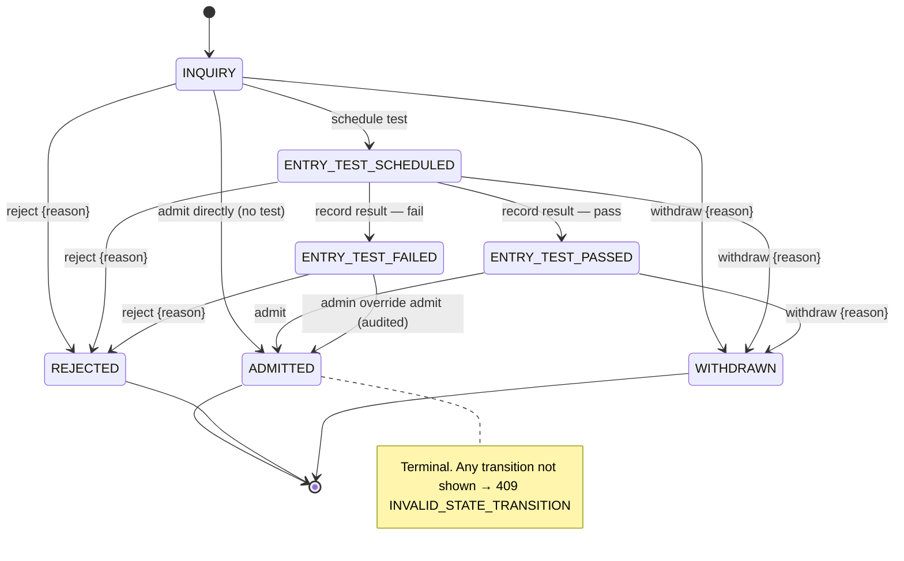
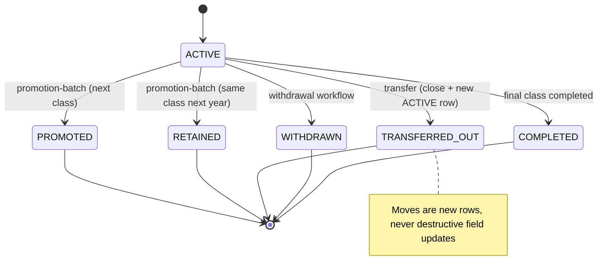
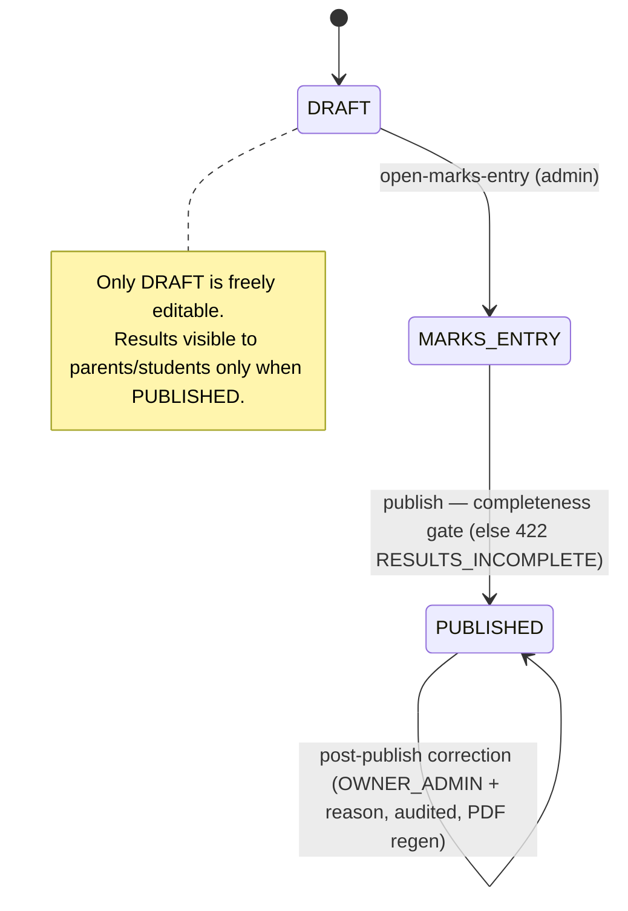
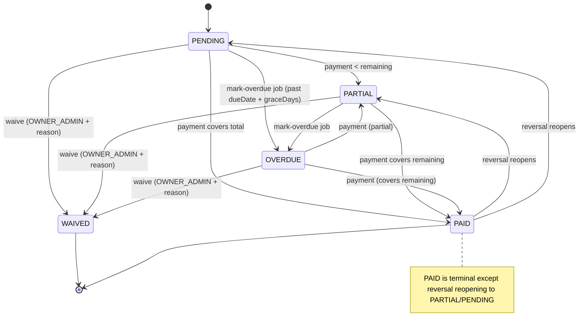
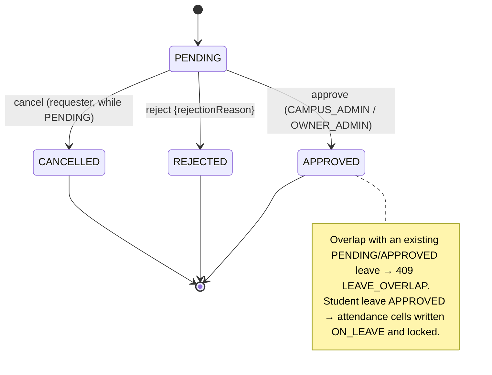

# Product Requirements Document (PRD) — v1.0 GA

**Product:** Multi-Tenant School Management System
**Document:** 01 — Product Requirements
**Audience:** Product Managers · Business Stakeholders · QA Leads
**Scope:** v1.0 GA only. Deferred features (v1.5 / v2.0 / Never) are listed in [§7 Out of Scope](#7-out-of-scope).
**Authority:** All names, enums, numbers, and rules conform to `docs/consistency-register.md` (v1.0, LOCKED) and `school-management-master-blueprint.md` (v2.0). Where this PRD would conflict with the register, the register wins.

---

## 1. Executive Summary

### 1.1 Vision
A multi-tenant SaaS platform for private schools in Pakistan that runs the full daily operations of a school from one system: admissions, enrollment across academic years, attendance, examinations and report cards, fee management (with fines, discounts, advances, and reversals), staff HR and payroll, parent communication (SMS-first), and document issuance.

### 1.2 Target Market (v1)
- **Geography:** Pakistan (v1 market). English UI; Urdu SMS content supported; full i18n deferred to v2.
- **School size:** private schools of **200–3,000 students**, frequently **multi-campus**.
- **Primary buyers:** school owners / principals.
- **Primary daily users:** front-desk / admissions staff, accountants at fee counters, teachers (attendance + marks), campus admins, and parents (read-mostly portal).

### 1.3 Value Proposition
| Pain today | What the product delivers |
|---|---|
| Fees tracked in registers/spreadsheets; leakage and disputes | Auditable fee ledger: immutable payments, reversals-only corrections, gap-free receipt numbers |
| Parents uninformed about absence, results, dues | SMS-first communication on absence, receipts, results, and reminders |
| Records lost across academic years | Enrollment-based domain spine — every record is scoped to an academic year, history never overwritten |
| Multi-campus owners lack a single view | One tenant spans all campuses; role- and campus-scoped dashboards and reports |
| Manual report cards and certificates | Automated report-card and certificate PDFs with fee-clearance gating |

### 1.4 Business Model
- **Sold per-school on subscription tiers:** `BASIC`, `PLUS`, `PRO` (`PlanTier`).
- Tiers cap monthly included **SMS credits**: BASIC 1k / PLUS 5k / PRO 20k.
- Tenants are addressed by subdomain (`{slug}.platform.pk`) or a verified custom domain. Vendor operations run from a separate console (`admin.platform.pk`).
- **Payments in v1 are recorded at the counter or via bank**; a self-serve online payment gateway is v2.

### 1.5 Success Criteria (product-level)
- A school can be provisioned and set up (year → campuses → classes/sections → subjects → fee heads/structures → grade scale → SMS templates) without vendor engineering involvement.
- Zero cross-tenant data exposure (CI-enforced).
- Fee-season peak handled: **500 concurrent payment submissions**; **10,000 SMS cleared in <30 minutes**.

---

## 2. Personas & Roles

Eight application roles (`Role` enum). A person is **one `User` row per school**; `roles` is an array, so one person may hold several roles at once.

### 2.1 Persona catalog
| Role | Persona | Scope | What they do daily |
|---|---|---|---|
| `PLATFORM_ADMIN` | Vendor operator | Cross-tenant (vendor-side) | Provisions/suspends tenants, manages plans & SMS credits, views platform analytics via `admin.platform.pk`. Never impersonates a tenant without an audited break-glass support session. |
| `OWNER_ADMIN` | School owner / principal | Whole school (all campuses) | Full control of one tenant: setup, users, fees policy, exams publish, reversals & waivers approval, promotion overrides. |
| `CAMPUS_ADMIN` | Campus head | One campus (`User.campusId` required) | Admin limited to their campus: admissions, students, attendance oversight, leave approvals, exams. |
| `ACCOUNTANT` | Fee-counter accountant | School or campus | Collects payments, generates invoice batches, manages advances, requests reversals, runs financial reports. |
| `TEACHER` | Class / subject teacher | Own assignments | Marks attendance for assigned sections; enters marks for assigned (section, subject); files own leaves; views own payslips. |
| `STAFF` | Non-teaching employee | Self | Views own payslips, files own leaves. |
| `PARENT` | Guardian | Own children | Reads portal (attendance, published results, invoices, documents); files leave requests for their children. |
| `STUDENT` | Enrolled student | Self | Read-only mirror of the parent child-view for self. |

### 2.2 Multi-role rule
**Effective permission = union of role grants; scope checks still apply per role.** A person with two roles gets the combined *set* of actions, but each action remains bounded by that role's scope (e.g. a `TEACHER, PARENT` can enter marks only for assigned subjects and can view child data only for linked students). Users holding `TEACHER` / `ACCOUNTANT` / `CAMPUS_ADMIN` / `STAFF` must have a `StaffProfile`; a `PARENT` must have a `ParentProfile`.

### 2.3 Role Conflict Matrix (multi-role resolution)
| Combined roles | Real-world example | Effective capability | Scope constraints that still bind |
|---|---|---|---|
| `[TEACHER, PARENT]` | A teacher whose child studies at the school | Marks-entry + attendance **and** child portal reads | Marks only for **assigned** (section, subject); child reads only for **linked** students (GuardianOfStudentGuard) |
| `[ACCOUNTANT, PARENT]` | An accountant whose child studies here | Fee collection **and** own child portal | Cannot see other families' children; fee actions unaffected |
| `[CAMPUS_ADMIN, TEACHER]` | A campus head who also teaches | Campus admin **and** marks/attendance for own classes | Admin actions limited to **own campus**; teaching actions to **own assignments** |
| `[STAFF, PARENT]` | A non-teaching employee who is also a parent | Own payslips/leaves **and** child portal | Each side limited to self / linked children respectively |
| `[OWNER_ADMIN, PARENT]` | Owner whose child studies here | Full school control **and** parent view | Owner scope is school-wide; parent view still limited to linked children |

> **Rule of thumb for QA:** never test a multi-role user by assuming one role "wins." Test that *each* granted action is permitted **and** that *each* scope boundary is independently enforced.

---

## 3. Functional Requirements by Module

Format: user stories with **Given / When / Then** acceptance criteria (AC) derived directly from the blueprint's Part II rules. Story IDs are stable references for the tracker.

### 3.1 Academic Years & Enrollment

**US-AY-01 — Create an academic year**
*As an* OWNER_ADMIN, *I want* to create an academic year *so that* all records can be scoped to it.
- **AC1** Given a school, when I create an `AcademicYear` with `name`, `startDate`, `endDate`, then it is saved for the school.
- **AC2** Given an existing current year, when I set a new year `isCurrent`, then **exactly one** year has `isCurrent=true` per school.
- **AC3** Given overlapping dates with an existing year, when I save, then the system rejects the overlap (service validation).

**US-AY-02 — Enroll a student into a section**
*As a* CAMPUS_ADMIN, *I want* placement to happen through an enrollment row *so that* history is preserved.
- **AC1** **Students are never linked directly to a section**; placement is always a `StudentEnrollment` row scoped to an academic year.
- **AC2** Given a student already ACTIVE in the year, when I create a second ACTIVE enrollment for the same year, then it is rejected (**one ACTIVE enrollment per student per academic year**).
- **AC3** Given `sectionCapacityMode = HARD` and a full section, when I enroll, then the system blocks with **422 `SECTION_FULL`**; given `ADVISORY` (default), it warns but allows.

**US-AY-03 — Transfer a student mid-year**
*As a* CAMPUS_ADMIN, *I want* to move a student between sections/campuses *so that* the change is recorded as history, not overwrite.
- **AC1** Given an ACTIVE enrollment, when I transfer via `POST /enrollments/transfer`, then the old enrollment is closed with `endedAt` and set `TRANSFERRED_OUT`, and a new ACTIVE enrollment is created. **Moves are new rows, never destructive field updates.**

**US-AY-04 — Year-end promotion**
*As an* OWNER_ADMIN/CAMPUS_ADMIN, *I want* to promote a section in bulk *so that* students advance to the next year.
- **AC1** Default target class = next class by `Class.order`; per-student override to RETAINED or WITHDRAWN.
- **AC2** Preconditions per student (server-enforced): final-term report card published; fee clearance if `promotionRequiresFeeClearance=true` (default true). **Overridable only by OWNER_ADMIN with an audited reason** (`PROMOTION_OVERRIDE`).
- **AC3** Execution is a queued, **idempotent** `promotion-batch` job keyed by (section, targetYear); re-run **skips already-processed** students; transactional per section.

### 3.2 Admissions Pipeline

**US-ADM-01 — Capture and progress an inquiry**
*As a* CAMPUS_ADMIN, *I want* to move an inquiry through its lifecycle *so that* admissions are tracked.
- **AC1** `Inquiry.status` transitions follow the state machine in [§4.1](#41-inquiry-status-flow) exactly; any other transition returns **409 `INVALID_STATE_TRANSITION`**.
- **AC2** REJECTED and WITHDRAWN require a `reason`.
- **AC3** Entry-test outcome lives in the status plus `EntryTest.score` (there is no `passed` boolean).

**US-ADM-02 — Admit a student (transactional)**
*As a* CAMPUS_ADMIN, *I want* one atomic admit action *so that* a student, guardian, enrollment, and optional invoice are created consistently.
- **AC1** The admit action (`POST /admissions`) is **transactional** and performs, in order: guardian resolution → create `Student` → create `StudentGuardian` link(s) → create ACTIVE `StudentEnrollment` in the current year → create `Admission` (inquiry → ADMITTED) → generate the admission invoice **if** an ADMISSION-type fee structure exists for the class.
- **AC2** **Guardian resolution never silently auto-merges:** the server searches existing `ParentProfile` by normalized phone and requires an explicit **link-or-create** choice. A new parent gets a `User` with `roles=[PARENT]`, status `INVITED`, and an SMS set-password link (30-min token).
- **AC3** Exactly one `StudentGuardian.isPrimary=true` per student (the primary receives SMS).
- **AC4** GR number uniqueness is `[schoolId, grNumber]` whether auto-sequenced (`grNumberMode=AUTO`) or manual (`MANUAL`); a duplicate returns **`GR_NUMBER_TAKEN`**.
- **AC5** If `Class.minAgeYears/maxAgeYears` are set, DOB is validated against the class age band (nullable = skip).

### 3.3 Attendance

**US-ATT-01 — Mark section attendance**
*As a* TEACHER, *I want* to mark a whole section in one screen *so that* daily attendance is fast.
- **AC1** One record per (enrollment, date, session); sessions are `[MORNING]` or `[MORNING, EVENING]` per `attendanceSessions`.
- **AC2** Write is rejected if: date is in the future; date is a `Holiday` or a weekly-off day (`weeklyOffDays`, default `[SUNDAY]`) unless an admin sets `allowHolidayOverride` (audited); enrollment is not ACTIVE; or the section is not among the teacher's assignments for that year (SectionOwnershipGuard).
- **AC3** `POST /attendance/bulk` returns **200** with `{succeeded, failed, errors[]}` — **partial-failure, not all-or-nothing**.

**US-ATT-02 — Edit lock window**
*As a* school, *I want* attendance to lock after a window *so that* records are trustworthy.
- **AC1** The marking teacher may edit for `attendanceEditWindowDays` (default 3) after the date; afterwards only CAMPUS_ADMIN/OWNER_ADMIN may edit, each post-window edit requires a **reason** and writes AuditLog (`ATTENDANCE_EDITED_POST_WINDOW`).
- **AC2** A second co-assigned teacher submitting a **differing** value gets **409 `ATTENDANCE_CONFLICT`** listing the diffs (no silent last-write-wins).

**US-ATT-03 — Leave integration & absence SMS**
- **AC1** When a student `StudentLeave` is APPROVED, a job writes/overwrites `ON_LEAVE` for each in-range (date, session) and **locks** those cells against teacher edits.
- **AC2** Absence SMS fires for **`ABSENT` only** (not LATE/HALF_DAY), to the **primary guardian**, **once per (student, date)**, deduplicated by key `absence:{enrollmentId}:{date}`. It **never** fires for ON_LEAVE, opt-out, or unverified numbers.

**US-ATT-04 — Staff attendance**
- **AC1** One record per (staffId, date, session); optional check-in/out timestamps; feeds payroll attendance-linked deductions.

### 3.4 Leave Management

**US-LV-01 — Student leave request**
*As a* PARENT, *I want* to request leave for my child *so that* absence is excused.
- **AC1** `StudentLeave` follows `PENDING → APPROVED | REJECTED`; `CANCELLED` is allowed by the requester while PENDING. REJECTED requires `rejectionReason`.
- **AC2** A new leave overlapping an existing PENDING/APPROVED leave for the same person returns **409 `LEAVE_OVERLAP`**.
- **AC3** A TEACHER may file a leave for their own section's student on a parent's behalf (source recorded).

**US-LV-02 — Staff leave with quotas**
*As a* STAFF member, *I want* to file leave *so that* my absence is recorded and paid correctly.
- **AC1** `StaffLeave.leaveType` is one of `CASUAL | SICK | UNPAID | OTHER`, with per-type annual quotas in `staffLeaveQuotas`.
- **AC2** Exceeding a quota **auto-flags the request `UNPAID`** (`isUnpaid=true`) unless an admin overrides.
- **AC3** Approvers are CAMPUS_ADMIN/OWNER_ADMIN.

### 3.5 Examinations & Report Cards

**US-EX-01 — Define exams within a term**
- **AC1** Each `ExamDefinition` belongs to a `Term` and carries `weightagePercent`.
- **AC2** The sum of a class's exam weightages within a term must equal **100** before that term's report cards can be generated, else **422 `WEIGHTAGE_SUM_INVALID`** (listing the sum).

**US-EX-02 — Enter marks**
*As a* TEACHER, *I want* to enter marks for my assigned subject *so that* results can be computed.
- **AC1** A teacher enters marks only for assigned (section, subject) pairs (SubjectOwnershipGuard).
- **AC2** `marksObtained ≤ totalMarks` else 422; bulk entry is upsert with per-row error reporting.
- **AC3** Absent in an exam → `isAbsent=true`, `marksObtained=null`, contributes 0 to that exam's weighted share; the report card prints "ABS".

**US-EX-03 — Publish results**
*As an* OWNER_ADMIN/CAMPUS_ADMIN, *I want* to publish *so that* parents/students can see results.
- **AC1** `ExamDefinition.status` flows `DRAFT → MARKS_ENTRY → PUBLISHED`. Parents/students see results **only when PUBLISHED**.
- **AC2** Completeness gate: every (enrolled student × subject assigned to the class) has a mark or `isAbsent`, else **422 `RESULTS_INCOMPLETE`** returning the missing list.
- **AC3** A post-publish mark change requires **OWNER_ADMIN + reason**, writes AuditLog (`GRADE_CHANGED_POST_PUBLISH`, old→new), regenerates the report-card PDF (old S3 version retained), and re-sends the result SMS flagged "Corrected".

**US-EX-04 — Generate report cards**
- **AC1** `POST /terms/:id/report-cards/generate` (admin action) queues a job that verifies all class exams in the term are PUBLISHED and weightages sum to 100, computes results, produces a PDF per student to S3, and creates `Document` (type `REPORT_CARD`) + `ReportCard` rows.
- **AC2** **Grades are computed at read/publish time** from the active `GradeScale`; there is no stored `grade` column.
- **AC3** Overall = mean of subject termPercents; **rank = dense rank** by overall percent within the section (ties share rank: 1,1,3); students absent from **all** exams are unranked.
- **AC4** A "result ready" SMS goes to the primary guardian after the PDF upload succeeds.

### 3.6 Fee Management

**US-FEE-01 — Define fee structures**
- **AC1** `FeeStructure` is per (school, campus, class, feeHead, academicYear) with `amount` and `frequency` (`MONTHLY | ANNUAL | ONE_TIME | ADMISSION`).
- **AC2** Editing a structure **never mutates already-generated invoices**; it affects future generation only.

**US-FEE-02 — Generate an invoice batch (idempotent)**
- **AC1** `POST /fees/invoice-batches {classId, month, year}` is unique on `[schoolId, classId, month, year]`; a duplicate returns the **existing** batch (**200, `alreadyExists: true`**).
- **AC2** The job creates one invoice per ACTIVE enrollment; per-student idempotency prevents a second batch-generated invoice for `[schoolId, studentId, month, year]`.
- **AC3** Discounts/scholarships apply **at generation time** as negative line items (transparent on the printed bill). Sibling discount (`siblingDiscountPercent`) auto-applies to the 2nd+ enrolled sibling as a distinct line. Stacking: FIXED after PERCENT; total discount capped at 100% of the head.
- **AC4** Mid-month admissions pro-rate per `midMonthProration` (`FULL | HALF | DAILY`, default FULL).

**US-FEE-03 — Collect a payment**
*As an* ACCOUNTANT, *I want* to record a payment *so that* the invoice updates and a receipt prints.
- **AC1** `POST /fees/invoices/:id/payments` **requires an `Idempotency-Key` header**; replay with the same hash returns the stored response, a different hash returns **409 `IDEMPOTENCY_KEY_REUSED`**.
- **AC2** Inside one serializable transaction: lock the invoice (`SELECT … FOR UPDATE`), validate `amountPaid ≤ remaining` (overpayment → **422 `OVERPAYMENT_USE_ADVANCE`**), insert `FeePayment` with a gap-free per-school `receiptNo`, recompute stored `paidAmount` and status.
- **AC3** `transactionRef` is mandatory for non-CASH methods; unique `[schoolId, method, transactionRef]` where present.
- **AC4** A receipt SMS is enqueued after commit.

**US-FEE-04 — Overdue & fines**
- **AC1** The nightly `mark-overdue` job sets `status=OVERDUE` past `dueDate + graceDays` and appends/updates a **single FINE line item** per `LateFeePolicy` (`FLAT | PER_DAY`, capped at `maxAmount`).
- **AC2** A fine waiver is an admin action reducing/removing the fine line, requiring **reason + AuditLog** (`FINE_WAIVED`).

**US-FEE-05 — Advances & credits**
- **AC1** `GuardianCredit` is a per-parent ledger; deposits via `POST /fees/advances`; auto-applied (oldest invoice first) to newly generated invoices before the SMS reminder; refundable by reversal.

**US-FEE-06 — Reversals & waivers**
- **AC1** **Payments are immutable.** Corrections are made via `PaymentReversal` only (own receipt number printed `RV-{n}`); invoice `paidAmount`/status recompute. **Only OWNER_ADMIN approves reversals** (`PAYMENT_REVERSED`).
- **AC2** `status=WAIVED` is set **only by OWNER_ADMIN with reason**; a waiver zeroes the remaining balance via a WAIVER line item — never by editing totals (`FEE_WAIVED`).
- **AC3** Invariants: `totalAmount = Σ items.amount`; `paidAmount = Σ payments − Σ reversals`; both verified nightly by `fee-integrity-check`.

### 3.7 Staff HR & Payroll

**US-HR-01 — Manage staff**
- **AC1** `StaffProfile` covers **all** employees (`staffType TEACHER | ADMIN | ACCOUNTANT | CLERK | SUPPORT`) with `employeeCode` unique per school and `employmentStatus (ACTIVE | ON_LEAVE | TERMINATED)`.
- **AC2** Bank account numbers are stored encrypted.

**US-HR-02 — Run payroll**
*As an* OWNER_ADMIN, *I want* to run monthly payroll per campus *so that* staff are paid correctly.
- **AC1** A `PayrollRun` is unique on `[schoolId, campusId, month, year]`; a queued job produces `Payslip` rows in DRAFT.
- **AC2** Per staff: `gross = basic + Σ allowances`; `attendanceDeduction = (unpaidLeaveDays + unexcusedAbsentDays) × (basic / workingDaysInMonth)` where workingDays excludes holidays/weekly-offs; `netPay = gross − fixedDeductions − attendanceDeduction`.
- **AC3** OWNER_ADMIN marks the run **APPROVED**, which **locks** payslips; disbursement is recorded per payslip (`paidAt`, `method`, `reference`).
- **AC4** Staff see **their own** payslips only.

### 3.8 SMS Communication

**US-SMS-01 — Templates & segmentation**
- **AC1** `SmsTemplate` exists per school per trigger (`FEE_REMINDER | FEE_RECEIPT | ABSENCE | RESULT_READY | LEAVE_STATUS | ACCOUNT_INVITE | MANUAL`) with `{placeholders}`; defaults seeded, editable by OWNER_ADMIN.
- **AC2** Segmentation is computed for GSM-7 vs UCS-2 (Urdu) and shown **before** send; credits are charged per segment.

**US-SMS-02 — Credits & overdraft**
- **AC1** Every send debits the `SmsCreditLedger`. Balance ≤ 0 **blocks non-critical sends** (**`INSUFFICIENT_SMS_CREDITS`**), but ABSENCE and FEE_RECEIPT still send into a small negative buffer (`smsOverdraftSegments`, default 100).

**US-SMS-03 — Delivery & recipient safety**
- **AC1** `POST /webhooks/sms/:provider` (HMAC-verified) updates `SmsStatus` `QUEUED → SENT → DELIVERED/FAILED`. Failed sends retry ×3 exponential backoff, then surface in a "Failed messages" screen with one-click re-queue.
- **AC2** Recipient = primary guardian only. Unverified numbers (`phoneVerifiedAt` null) receive **only the invite OTP** — nothing containing student PII (**`PHONE_UNVERIFIED`** guards PII sends).
- **AC3** The per-guardian opt-out flag is honored for MANUAL sends; transactional sends always allowed.

### 3.9 Documents & Certificates

**US-DOC-01 — Issue a certificate**
- **AC1** `Document.type` ∈ `LEAVING_CERT | CHARACTER_CERT | FEE_CLEARANCE | REPORT_CARD | PAYSLIP | RECEIPT`.
- **AC2** LEAVING_CERT is blocked while unpaid invoices exist **unless OWNER_ADMIN overrides with reason** (`WITHDRAWAL_FEE_OVERRIDE`).
- **AC3** Files live in S3 (versioned); access is only via **10-minute pre-signed URLs** issued after an ownership check.

**US-DOC-02 — Student withdrawal workflow**
- **AC1** `POST /students/:id/withdraw`: admin initiates → system checks fees → issues FEE_CLEARANCE then LEAVING_CERT → closes enrollment as WITHDRAWN → deactivates the student portal account.

### 3.10 Audit & Reports

**US-AUD-01 — Audit trail on sensitive actions**
- **AC1** Every sensitive mutation writes an `AuditLog` row with `action`, `entityType`, `entityId`, old/new values, reason, and `requestId`. Catalog of actions: FEE_WAIVED, FINE_WAIVED, PAYMENT_REVERSED, GRADE_CHANGED_POST_PUBLISH, ROLE_CHANGED, ATTENDANCE_EDITED_POST_WINDOW, DISCOUNT_APPROVED/REVOKED, PROMOTION_OVERRIDE, WITHDRAWAL_FEE_OVERRIDE, PII_ANONYMIZED, DATA_EXPORTED, SUPPORT_SESSION_STARTED, USER_DISABLED, MFA_RESET.
- **AC2** `GET /audit-logs` filters by from/to, action, userId, entityType+entityId. OWNER_ADMIN sees all; CAMPUS_ADMIN sees own campus.

**US-AUD-02 — Reports suite**
- **AC1** The seven reports are: daily-collection, fee-ledger, attendance-register, class-strength, defaulters, exam-summary, sms-usage. Each supports documented filters and `format=json|csv|pdf` (PDF → 202 + a document).
- **AC2** A **defaulter** is a student with ≥1 invoice past due and unpaid; `GET /fees/defaulters` filters by campusId and minDays.
- **AC3** Dashboards are role-shaped: OWNER_ADMIN sees all; CAMPUS_ADMIN own campus; ACCOUNTANT financial; TEACHER own sections; PARENT own children; STUDENT self.

---

## 4. State Machines

### 4.1 Inquiry status flow

### 4.2 Enrollment status flow

### 4.3 ExamDefinition status flow

### 4.4 FeeInvoice status flow

### 4.5 Leave status flow (student & staff)

---

## 5. Business Rules Catalog (25 critical invariants)

These are testable invariants drawn from §7–§15. Each is a QA acceptance anchor.

| # | Invariant | Source |
|---|---|---|
| BR-01 | Students are never linked directly to a section; placement is always a `StudentEnrollment` scoped to an academic year. | §7 |
| BR-02 | One ACTIVE enrollment per student per academic year (partial unique). | §7 |
| BR-03 | Exactly one `AcademicYear.isCurrent=true` per school. | §7 |
| BR-04 | Academic years never overlap (service validation). | §7 |
| BR-05 | Transfers close the old enrollment (`endedAt`, TRANSFERRED_OUT) and create a new ACTIVE row — never destructive updates. | §7 |
| BR-06 | Promotion preconditions (report card published + fee clearance) are overridable only by OWNER_ADMIN with an audited reason. | §7 |
| BR-07 | `promotion-batch` is idempotent per (section, targetYear); re-run skips processed students. | §7 |
| BR-08 | Inquiry transitions are exactly the state machine; others → 409 `INVALID_STATE_TRANSITION`; REJECTED/WITHDRAWN require a reason. | §8 |
| BR-09 | Admit is one transaction: guardian resolution → Student → StudentGuardian → ACTIVE enrollment → Admission → admission invoice (if ADMISSION structure exists). | §8 |
| BR-10 | Guardian resolution never silently auto-merges; link-or-create is an explicit choice. | §8 |
| BR-11 | GR number is unique per `[schoolId, grNumber]`; exactly one `isPrimary` guardian per student. | §8 |
| BR-12 | Attendance is one record per (enrollment, date, session); no future dates, no holidays/weekly-offs without audited override. | §9 |
| BR-13 | Post-window attendance edits are admin-only, require a reason, and write AuditLog; cross-teacher differing values → 409 `ATTENDANCE_CONFLICT`. | §9 |
| BR-14 | Absence SMS fires for ABSENT only, to the primary guardian, once per (student, date), keyed `absence:{enrollmentId}:{date}`; never for ON_LEAVE. | §9 |
| BR-15 | Leaves are `PENDING → APPROVED | REJECTED` (CANCELLED while PENDING); overlap → 409 `LEAVE_OVERLAP`; rejection needs `rejectionReason`. | §10 |
| BR-16 | Staff leave over quota auto-flags UNPAID unless admin overrides. | §10 |
| BR-17 | A class's exam weightages within a term must sum to 100 before report cards generate, else `WEIGHTAGE_SUM_INVALID`. | §11 |
| BR-18 | Grades are computed at read/publish time from the active GradeScale; no stored grade column. | §11 |
| BR-19 | Publishing requires completeness (every student × assigned subject) else 422 `RESULTS_INCOMPLETE`; results visible only when PUBLISHED. | §11 |
| BR-20 | Post-publish mark change: OWNER_ADMIN + reason + AuditLog + PDF regen + "Corrected" SMS. | §11 |
| BR-21 | Invoice generation is idempotent on `[schoolId, classId, month, year]`; duplicate returns existing batch (200, `alreadyExists: true`). | §12 |
| BR-22 | Payment requires `Idempotency-Key`, runs in a serializable transaction locking the invoice row; overpayment → 422 `OVERPAYMENT_USE_ADVANCE`. | §12, §25.4 |
| BR-23 | `totalAmount = Σ items.amount`; `paidAmount = Σ payments − Σ reversals`; `paidAmount ≤ totalAmount`. | §12 |
| BR-24 | Payments are immutable; corrections via PaymentReversal only; only OWNER_ADMIN approves reversals and sets WAIVED. | §12 |
| BR-25 | Certificates/documents are served only via 10-minute pre-signed URLs after an ownership check; LEAVING_CERT blocked on unpaid dues unless OWNER_ADMIN overrides. | §15 |

---

## 6. Glossary

| Term | Definition |
|---|---|
| **GR number** | General Register number — the student's permanent registration ID, unique per school, assigned at admission and never reused. |
| **CNIC** | Pakistani national identity card number (guardian PII; encrypted at rest). |
| **Session (attendance)** | A marked slot within a day (MORNING/EVENING); schools configure one or two. |
| **Term** | A grading period within an academic year (e.g., Term 1, Term 2) into which exams roll up. |
| **Fee head** | A category of charge (Tuition, Annual Fund, Exam Fee…). |
| **Defaulter** | A student with ≥1 invoice past due and unpaid. |
| **Tenant** | One school (all campuses included). |

---

## 7. Out of Scope (v1.0)

Deferred features. v1.0 ships **no half-features**; nothing carries flags for descoped modules.

| Feature | Status | Notes |
|---|---|---|
| Visual timetable (grid editor) | **v1.5** | v1.0 ships teacher–subject **assignment** only, which feeds the timetable. |
| Homework / diary | **v1.5** | — |
| In-app + email notifications | **v1.5** | v1.0 is SMS-first. |
| Marks CSV import wizard | **v1.5** | v1.0 ships the **students** CSV import only. |
| Library | **v2.0** | — |
| Transport (routes, stops, transport fees) | **v2.0** | — |
| Online payment gateway (cards/wallets self-serve) | **v2.0** | v1 records payments taken at counter or via bank. |
| Multi-language UI (full i18n) | **v2.0** | Urdu SMS content is supported in v1; UI is English. |
| Per-school timezone | **v2.0** | v1 is fixed to Asia/Karachi. |
| Hostel | **Re-evaluate on demand** | The `isHostelized` flag from the old schema is removed. |
| Inventory | **Out of scope** | — |

---

## Changelog
- **v1.0** — Initial PRD. Derived from blueprint v2.0 and Consistency Register v1.0. Covers v1.0 GA scope only.
