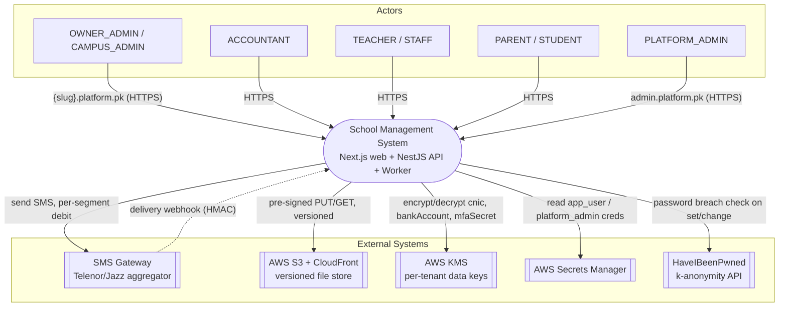
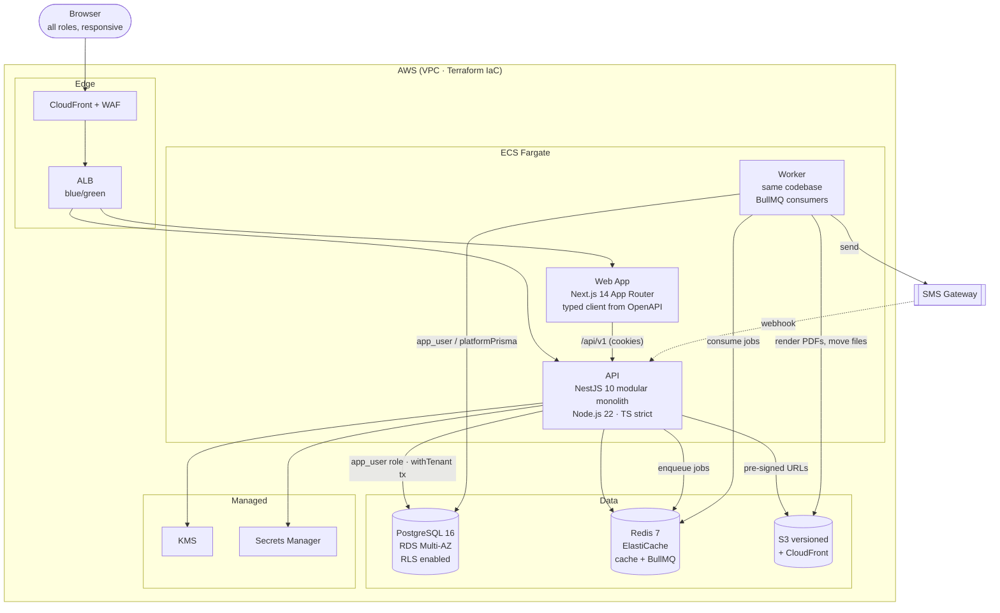
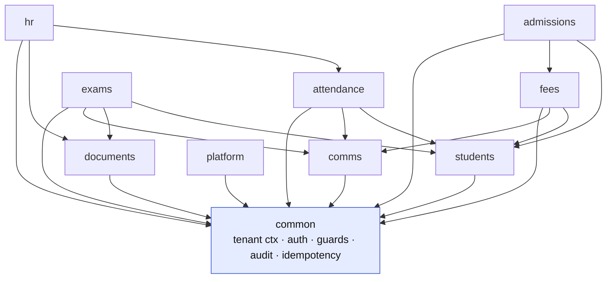
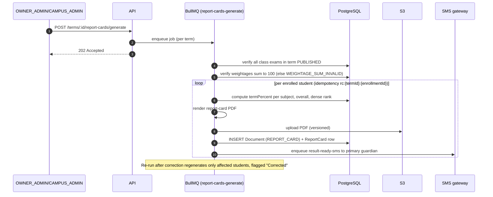
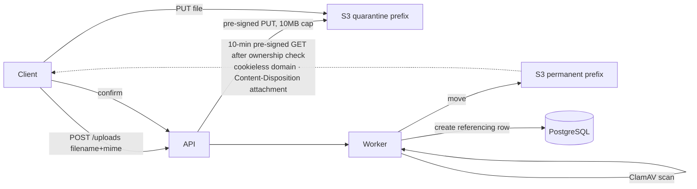

# Technical Architecture Document (TAD) — v1.0

**Product:** Multi-Tenant School Management System
**Document:** 02 — Technical Architecture
**Audience:** Senior Engineers · DevOps · Security Auditors
**Authority:** Conforms to `docs/consistency-register.md` (v1.0, LOCKED) and `school-management-master-blueprint.md` (v2.0). Where this document would conflict with the register, the register wins.

---

## 1. System Context Diagram

The system is a single logical SaaS product serving multiple tenants (schools). Human actors reach it over HTTPS; the platform depends on a small set of external systems.



**Notes**
- Tenants are addressed by subdomain (`{slug}.platform.pk`) or a verified custom domain; the vendor console is a separate host (`admin.platform.pk`).
- The SMS gateway relationship is bidirectional: outbound sends, inbound HMAC-verified delivery webhooks (`POST /webhooks/sms/:provider`).
- Redis is intentionally **absent** from this diagram's external-dependency list because it is ephemeral (cache/queues only); nothing recovery-critical lives only in Redis.

---

## 2. Container Diagram (C4 Level 2)



**Container responsibilities**
| Container | Responsibility | Key constraint |
|---|---|---|
| **Web App** (Next.js 14) | Single responsive app serving all roles; typed API client generated from the OpenAPI build artifact | Contract drift impossible — client regenerated from server-emitted spec |
| **API** (NestJS 10) | Modular monolith; request pipeline, guards, tenant context, synchronous DB work | Every request wraps handler DB work in `withTenant` transaction |
| **Worker** | Second deployable sharing the codebase; consumes BullMQ queues | Opens its own `withTenant` per unit of work; never holds a transaction across queue waits |
| **PostgreSQL 16** | Source of truth; RLS-enforced tenant isolation | `app_user` has **no** `BYPASSRLS`; `platform_admin` (BYPASSRLS) creds never reach the API container |
| **Redis 7** | Cache (tenant resolution, dashboards, denylist) + BullMQ queues | Ephemeral by design |
| **S3 + CloudFront** | Versioned files; uploads via quarantine pipeline | Served only via 10-minute pre-signed GETs after ownership check |

---

## 3. Tenancy Architecture Deep Dive

Tenancy is **pooled**: one database, shared schema, every tenant-scoped row carries `school_id`. Isolation is defense-in-depth across three independent layers — a bug in any one is caught by the others.

### 3.1 The three layers

| Layer | Mechanism | What it defends against |
|---|---|---|
| **1 — Application (Prisma Client Extension)** | Injects/asserts `schoolId` on **every** operation (see table below). Missing `cls.schoolId` on a tenant-scoped model → throw (fail-closed). | Accidental omission of a `where: {schoolId}` in service code |
| **2 — Database (RLS)** | `ENABLE` + `FORCE ROW LEVEL SECURITY` with a `tenant_isolation` policy (`USING` + `WITH CHECK`) on **every** `school_id`-bearing table. `current_setting('app.current_school_id', true)` returns NULL when unset → zero rows. | Application bugs that slip past Layer 1, and non-superuser DB roles |
| **3 — CI (isolation suite, merge-blocking)** | Seeds School A + School B; asserts every cross-tenant read/write returns 403/404/empty and a raw-SQL probe inside `withTenant(A)` selecting B's rows returns 0. Toggles the extension off in one variant to prove RLS alone holds. | Regressions — failing this suite blocks merge |

**Prisma Client Extension behavior (Layer 1), per operation on tenant-scoped models:**

| Operations | Behavior |
|---|---|
| `findMany, findFirst, count, aggregate, groupBy` | merge `where: { schoolId }` |
| `findUnique, findUniqueOrThrow` | rewritten to `findFirst` with `schoolId` merged |
| `create, createMany` | inject `schoolId` into `data`; a different `schoolId` supplied → throw `TenantViolationError` |
| `update, updateMany, delete, deleteMany, upsert` | merge `schoolId` into `where` (and into the `create` arm of upsert) |

**RLS policy shape (Layer 2), applied to every tenant table:**
```sql
ALTER TABLE students ENABLE ROW LEVEL SECURITY;
ALTER TABLE students FORCE ROW LEVEL SECURITY;
CREATE POLICY tenant_isolation ON students
  FOR ALL
  USING (school_id = current_setting('app.current_school_id', true)::uuid)
  WITH CHECK (school_id = current_setting('app.current_school_id', true)::uuid);
```
> `schools` itself is **not** RLS'd (tenant resolution needs to read it) and carries no child data. A CI check greps the schema and fails if any `school_id`-bearing table lacks a policy.

### 3.2 Request lifecycle (Host → RLS → Query)

The critical correctness property: the `set_config(...)` and the queries must **share one transaction on one connection**, or the transaction-local RLS variable does nothing. The pipeline enforces this via `withTenant`.

```mermaid
sequenceDiagram
    autonumber
    participant B as Browser (Host header)
    participant MW as TenantResolutionMiddleware
    participant R as Redis (tenant cache)
    participant G as JwtAuthGuard → TenantScopeGuard → RolesGuard → Ownership guards
    participant I as withTenant Interceptor
    participant TX as PG Transaction (app_user)
    participant S as Service / Prisma Extension

    B->>MW: request (pre-auth)
    MW->>R: GET tenant:{host} (TTL 60s)
    alt cache miss
        MW->>TX: resolve custom_domain / subdomain
        MW->>R: SET tenant:{host} {id, planTier, isActive}
    end
    alt tenant suspended
        MW-->>B: 403 TENANT_SUSPENDED
    end
    MW->>MW: cls.schoolId, cls.planTier set
    B->>G: (JWT cookie)
    G->>G: validate JWT; assert req.user.schoolId === cls.schoolId else 403 TENANT_MISMATCH
    G->>G: RolesGuard + §22.8 ownership guards
    G->>I: enter withTenant
    I->>TX: BEGIN
    I->>TX: SELECT set_config('app.current_school_id', $schoolId, true)
    I->>S: run handler on tx-bound client
    S->>TX: queries (RLS filters by app.current_school_id)
    S-->>I: result
    I->>TX: COMMIT
    I-->>B: response
```

**Key guarantees**
- Tenant context is populated by middleware **before** the auth guard, so `POST /auth/login` works with no JWT.
- `set_config(..., true)` is **transaction-local** and **parameterized** (`$1`, UUID-validated) — never string-interpolated.
- Suspension is cache-invalidated by an explicit `DEL` on suspend/reactivate/domain-change (not just TTL), covered by an integration test asserting a 403 on the *next* request.
- Workers replicate this: they set CLS from the job payload's `schoolId` and open their own `withTenant` per unit. Cross-tenant platform jobs use a separate `platformPrisma` client on the `platform_admin` role.
- **Ops constraint:** if PgBouncer is introduced, it must run in **session pooling** mode for these connections (or be bypassed), because transaction-local settings require connection affinity.

---

## 4. Module Boundaries

A **modular monolith**: one NestJS deployable with strict module boundaries. Modules communicate through **exported services only** — ESLint boundary rules enforce import direction. The Worker is a second deployable sharing the same codebase.

### 4.1 The ten modules (§16)
| Module | Owns |
|---|---|
| `admissions` | Inquiry lifecycle, entry tests, the transactional admit action |
| `students` | Students, guardians, enrollment, promotion, transfers |
| `attendance` | Student + staff attendance, edit-lock windows, leave integration |
| `exams` | Grade scales, terms, exam definitions, results, report cards |
| `fees` | Fee structures, invoice batches, payments, discounts, fines, advances, reversals, defaulters |
| `hr` | Staff profiles, salary structures, payroll runs, payslips |
| `comms` | SMS templates, sends, credits, delivery webhooks |
| `documents` | Uploads pipeline, certificates, document issuance |
| `platform` | Vendor console: provisioning, suspend/reactivate, SMS credits, support sessions, analytics |
| `common` | Cross-cutting: tenant context, auth, guards, audit, idempotency, error codes |

### 4.2 Dependency direction



**Rules**
- Every module depends on `common`; `common` depends on nothing above it.
- No cyclic imports; the boundary lint fails the build on a back-edge.
- Cross-module calls go through a module's **exported service interface**, never its internal repositories.
- Rationale: preserves microservice-extraction optionality without paying distributed-systems cost at this scale.

---

## 5. Data Flow Diagrams

### 5.1 Fee payment — idempotency + row locking
```mermaid
sequenceDiagram
    autonumber
    participant Acc as Accountant (UI)
    participant API
    participant IK as IdempotencyKey store
    participant DB as PostgreSQL
    participant Q as BullMQ

    Acc->>API: POST /fees/invoices/:id/payments (Idempotency-Key)
    API->>API: guards (§19) + tenant tx opens
    API->>IK: lookup [schoolId, key]
    alt replay, same request hash
        IK-->>API: stored response
        API-->>Acc: 200 (replayed)
    else same key, different hash
        API-->>Acc: 409 IDEMPOTENCY_KEY_REUSED
    else new key
        API->>DB: BEGIN (serializable); set_config(school)
        API->>DB: SELECT invoice FOR UPDATE
        API->>DB: assert amountPaid <= remaining (else 422 OVERPAYMENT_USE_ADVANCE)
        API->>DB: INSERT FeePayment (receiptNo = next, gap-free)
        API->>DB: UPDATE invoice paid_amount + status (PARTIAL/PAID)
        API->>DB: INSERT AuditLog if waiver-adjacent
        API->>IK: store [schoolId, key] + response
        API->>DB: COMMIT
        API->>Q: enqueue fee-receipt-sms (key receipt:{paymentId})
        API-->>Acc: 201 (printable receipt)
        Q->>Q: render template, debit SmsCreditLedger, call gateway, write SmsLog
    end
```

### 5.2 Admission — guardian resolution → enrollment → invoice
```mermaid
sequenceDiagram
    autonumber
    participant Adm as Admissions staff (UI)
    participant API
    participant DB as PostgreSQL
    participant Q as BullMQ

    Adm->>API: POST /admissions {inquiryId, studentFields, guardianChoice}
    API->>DB: BEGIN; set_config(school)
    API->>DB: search ParentProfile by normalized phone
    alt existing parent chosen
        API->>DB: link only (StudentGuardian)
    else create new (explicit choice — never auto-merge)
        API->>DB: INSERT User roles=[PARENT] status=INVITED (no password)
        API->>DB: INSERT ParentProfile
    end
    API->>DB: INSERT Student (GR: nextGrNumber or MANUAL; unique [schoolId, grNumber])
    API->>DB: INSERT StudentGuardian(s) — exactly one isPrimary=true
    API->>DB: validate DOB vs Class.minAgeYears/maxAgeYears (if set)
    API->>DB: INSERT ACTIVE StudentEnrollment (current academic year)
    API->>DB: INSERT Admission; Inquiry.status = ADMITTED
    opt ADMISSION-type fee structure exists for class
        API->>DB: INSERT admission FeeInvoice (+ items) in same tx
    end
    API->>DB: COMMIT
    opt new parent created
        API->>Q: enqueue invite-sms (30-min set-password token)
    end
    API-->>Adm: 201 (student + enrollment + invoice)
```

### 5.3 Report card generation — trigger → compute → PDF → S3 → SMS


---

## 6. Technology Justification

| Decision | Chosen | Rejected alternative(s) | Why chosen |
|---|---|---|---|
| **Tenancy model** | Pooled (one DB, shared schema, `school_id` + RLS) | schema-per-tenant; database-per-tenant | Schema-per-tenant = migration fan-out pain at 1,000+ schools; DB-per-tenant = cost/ops overhead disproportionate for this market. Known cost (single-tenant restore) is mitigated by the tenant-export/restore procedure. |
| **Application shape** | Modular monolith (NestJS) + separate Worker | Microservices | Preserves extraction optionality without distributed-systems cost at this scale; strict module boundaries keep it clean. |
| **Backend framework** | NestJS 10 | Bare Express/Fastify | First-class DI, guards/interceptors pipeline (needed for the layered tenant/authz model), `@nestjs/swagger` → OpenAPI build artifact. |
| **ORM** | Prisma (snake_case `@map`/`@@map`) | TypeORM; raw SQL everywhere | Client extension gives a single choke-point for tenant scoping; snake_case mapping keeps RLS policies and raw SQL predictable. |
| **Database** | PostgreSQL 16 (RDS Multi-AZ) | MySQL; NoSQL | RLS is the load-bearing isolation layer; strong relational integrity (composite tenant-chain FKs); partial unique indexes and CHECK constraints. |
| **Cache / queue** | Redis 7 + BullMQ | DB-backed queue; SQS | Low-latency cache (tenant/dashboard/denylist) + mature job semantics (retries, DLQ); ephemeral is acceptable since nothing recovery-critical lives only here. |
| **Frontend** | Next.js 14 (App Router), typed client from OpenAPI | Separate SPA per role; hand-written API client | One responsive app for all roles; generated client makes contract drift impossible. |
| **Auth transport** | httpOnly/Secure/SameSite=Strict cookies + CSRF double-submit | JWT in localStorage | XSS cannot exfiltrate cookie-stored tokens; CSRF handled by double-submit token. |
| **Password hashing** | argon2id (64 MB, 3 iters) | bcrypt-only | Memory-hard; legacy bcrypt imports rehashed on first login. |
| **Files** | S3 versioned + CloudFront, quarantine pipeline | Direct-to-permanent uploads | Versioning aids corrections/retention; quarantine + ClamAV + magic-byte check closes malicious-upload threat. |

---

## 7. Integration Points

### 7.1 SMS gateway — adapter pattern
- A **pluggable gateway adapter** (Telenor/Jazz aggregator) sits behind a stable interface, so provider config can change without touching call sites (the adapter interface is fixed now; provider specifics are deliberately deferred).
- **Outbound:** per-segment GSM-7 vs UCS-2 (Urdu) segmentation is computed and shown before send; each send debits `SmsCreditLedger`. Balance ≤ 0 blocks non-critical sends (`INSUFFICIENT_SMS_CREDITS`) but ABSENCE and FEE_RECEIPT still send into the `smsOverdraftSegments` buffer (default 100).
- **Retries:** failed sends retry ×3 exponential backoff, then surface in the "Failed messages" screen with one-click re-queue.
- **Recipient safety:** primary guardian only; unverified numbers receive only the invite OTP — never student PII (`PHONE_UNVERIFIED`).

### 7.2 S3 upload pipeline — quarantine → validate → permanent

Single pipeline for all uploads (student photos, marks-import CSVs, logo). The 10 MB cap is enforced by the S3 policy, not just the app.

### 7.3 Webhook HMAC verification
- `POST /webhooks/sms/:provider` is a **public** route (no JWT) but **HMAC-authenticated** instead, and host-exempt from tenant resolution.
- It updates `SmsStatus` `QUEUED → SENT → DELIVERED/FAILED`, looked up by `gatewayMessageId` (indexed).
- It is the **only** state-changing route exempt from CSRF double-submit (it isn't a browser request).

### 7.4 KMS & Secrets Manager
- Field-level **AES-256-GCM** with per-tenant KMS data keys for `cnic_enc`, `bank_account_enc`, `mfa_secret_enc`; encrypt/decrypt happens in a Prisma extension so services see plaintext. Tenant deletion **crypto-shreds** the tenant data key.
- `app_user` and `platform_admin` DB credentials live in **Secrets Manager** under separate secrets; the API container never receives the `platform_admin` (BYPASSRLS) secret.

---

## Changelog
- **v1.0** — Initial Technical Architecture Document. Derived from blueprint v2.0 and Consistency Register v1.0.
