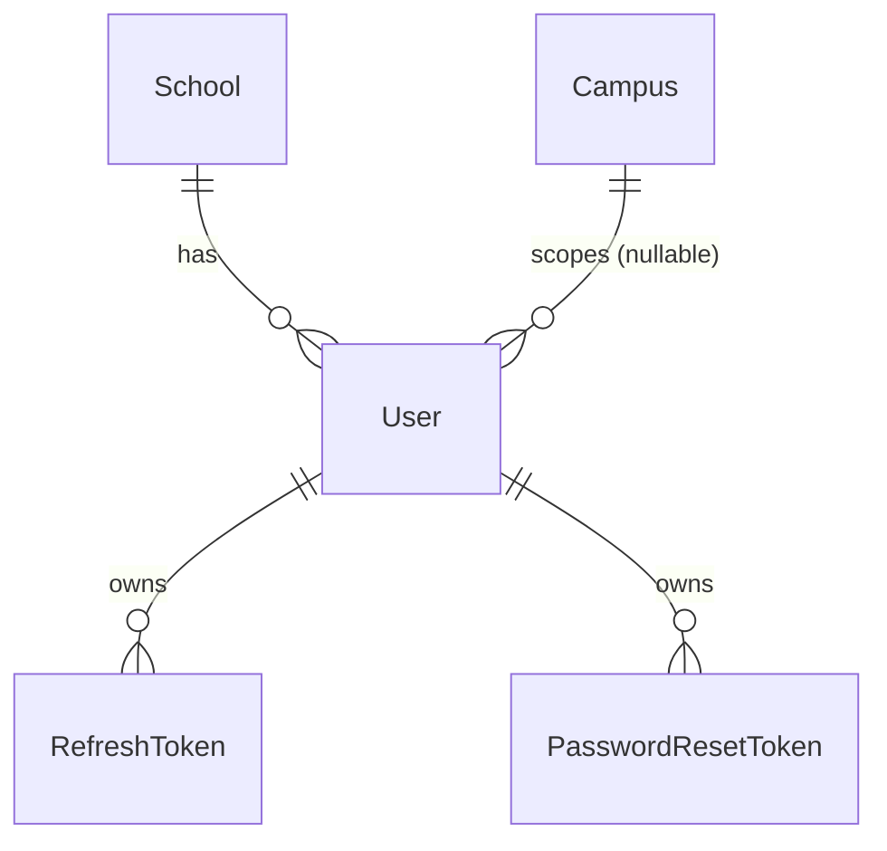
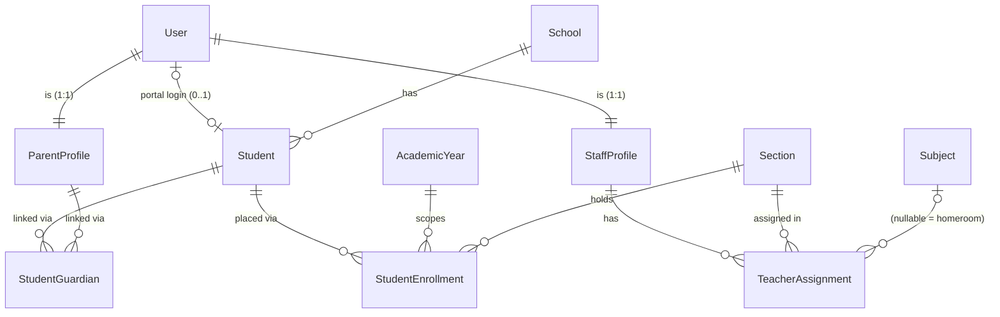
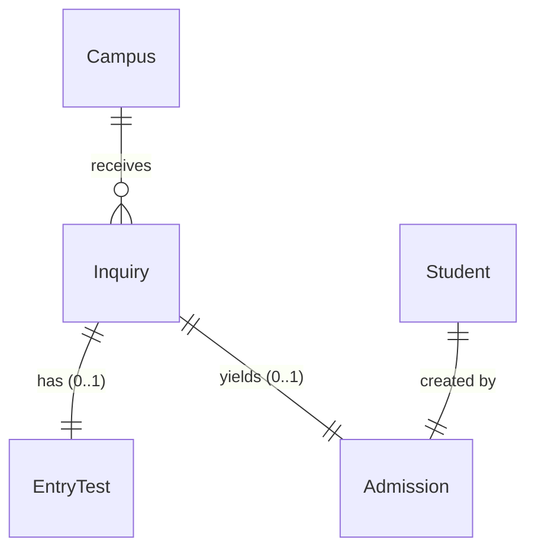
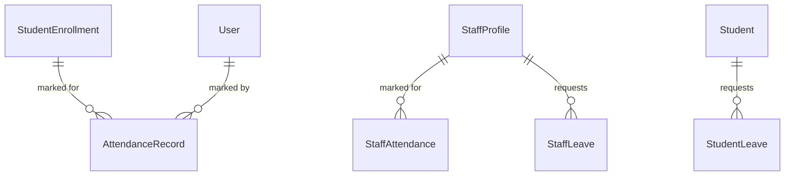
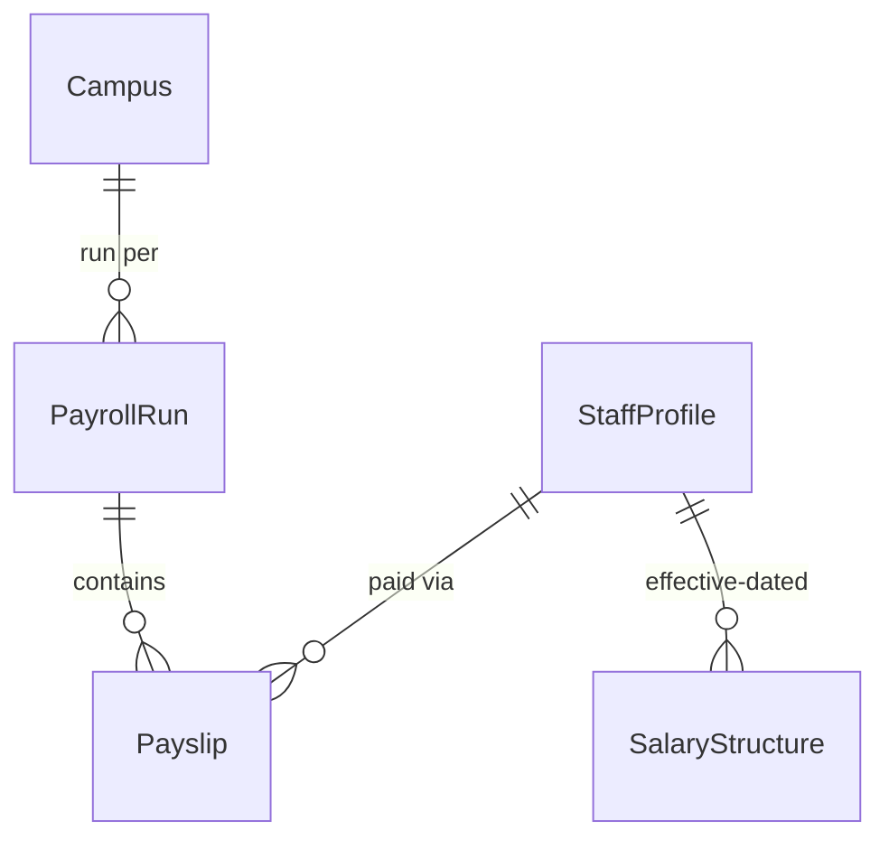
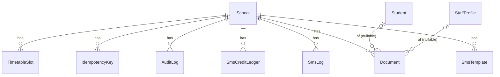

# Database Schema & Entity-Relationship Diagram — v1.0

**Product:** Multi-Tenant School Management System
**Document:** 03 — Database Schema & ERD
**Audience:** Backend Engineers · DBAs · Data Analysts
**Authority:** Conforms to `docs/consistency-register.md` (v1.0, LOCKED) and the authoritative Prisma schema in `school-management-master-blueprint.md` §17. Where this document would conflict with the register/blueprint, those win.

**Global conventions (§17):**
- Every model `@@map`s to a snake_case table; every field `@map`s to a snake_case column.
- PKs: `String @id @default(uuid()) @db.Uuid`.
- Every tenant table's first scalar is `schoolId String @db.Uuid` with a real relation to `School`.
- Money: `Decimal @db.Decimal(12, 2)`. Timestamps: `createdAt @default(now())`, `updatedAt @updatedAt`.
- Soft delete via `deletedAt DateTime?` (only `User`, `Student`).
- Relation default `onDelete: Restrict` except explicit `Cascade` on `student_guardians` and `fee_invoice_items`.
- Tenant-chain: child rows carry composite FK `(parentId, schoolId)` → parent's `@@unique([id, schoolId])`.

---

## 1. Entity-Relationship Diagram (by domain)

### 1.1 Setup / structure
```mermaid
erDiagram
    School ||--o{ Campus : has
    School ||--o{ AcademicYear : has
    School ||--o{ Holiday : has
    Campus ||--o{ Class : has
    Class  ||--o{ Section : has
    Class  ||--o{ Subject : has
    AcademicYear ||--o{ Term : has
    Campus ||--o{ Holiday : "scopes (nullable)"
```

### 1.2 Identity


### 1.3 People & enrollment


### 1.4 Admissions


### 1.5 Fees
```mermaid
erDiagram
    Class ||--o{ FeeStructure : "priced by"
    FeeHead ||--o{ FeeStructure : categorizes
    Class ||--o{ FeeInvoiceBatch : "batched for"
    Student ||--o{ FeeInvoice : billed
    StudentEnrollment ||--o{ FeeInvoice : scopes
    FeeInvoice ||--o{ FeeInvoiceItem : "line items"
    FeeInvoice ||--o{ FeePayment : "paid by"
    FeePayment ||--|| PaymentReversal : "reversed by (0..1)"
    Student ||--o{ Discount : "granted"
    School ||--|| LateFeePolicy : "has (0..1)"
    ParentProfile ||--o{ GuardianCredit : "ledger"
```

### 1.6 Attendance & leaves


### 1.7 Examinations
```mermaid
erDiagram
    School ||--o{ GradeScale : has
    AcademicYear ||--o{ GradeScale : scopes
    Term ||--o{ ExamDefinition : contains
    Class ||--o{ ExamDefinition : "for"
    ExamDefinition ||--o{ ExamResult : produces
    StudentEnrollment ||--o{ ExamResult : "scored"
    Subject ||--o{ ExamResult : "in"
    Term ||--o{ ReportCard : "rolls up"
    StudentEnrollment ||--|| ReportCard : "per term"
```

### 1.8 HR / payroll


### 1.9 Communication, documents, platform


> **Cardinality legend:** `||--o{` one-to-many · `||--||` one-to-one (required) · `|o--o|` / `|o--o{` optional (0..1 / 0..many). All relationships are additionally bounded by `school_id` (the tenant chain), enforced by composite FKs.

---

## 2. Schema Reference Tables

Legend — **Constraints** column: `PK` primary key · `U` part of a unique · `FK` foreign key · `IX` part of an index · `enc` encrypted at rest.

### 2.1 `School` → `schools`  *(tenant root; not RLS'd; not tenant-scoped)*
| Field | Prisma | DB type | Constraints | Default | Description | Column |
|---|---|---|---|---|---|---|
| id | String | uuid | PK | uuid() | Tenant id | `id` |
| name | String | text | | | School name | `name` |
| subdomain | String | text | U (unique) | | `{slug}.platform.pk` | `subdomain` |
| customDomain | String? | text | U (unique) | null | Verified custom domain | `custom_domain` |
| planTier | PlanTier | enum | | BASIC | Subscription tier | `plan_tier` |
| isActive | Boolean | bool | | true | Suspended → false | `is_active` |
| suspendedAt | DateTime? | timestamptz | | null | Suspension time | `suspended_at` |
| grNumberMode | String | text | | "AUTO" | AUTO \| MANUAL | `gr_number_mode` |
| grPrefix | String | text | | "" | GR number prefix | `gr_prefix` |
| nextGrNumber | Int | int | | 1 | Auto GR counter | `next_gr_number` |
| nextReceiptNo | Int | int | | 1 | Receipt counter | `next_receipt_no` |
| settings | Json | jsonb | | {} | `SchoolSettings` (Zod) | `settings` |
| createdAt / updatedAt | DateTime | timestamptz | | now() / auto | Timestamps | `created_at` / `updated_at` |

### 2.2 `Campus` → `campuses`
| Field | Prisma | DB type | Constraints | Default | Description | Column |
|---|---|---|---|---|---|---|
| id | String | uuid | PK, U`[id,schoolId]` | uuid() | | `id` |
| schoolId | String | uuid | FK→School, U`[schoolId,name]` | | Tenant | `school_id` |
| name | String | text | U`[schoolId,name]` | | Campus name | `name` |
| address | String? | text | | null | | `address` |
| isActive | Boolean | bool | | true | | `is_active` |
| createdAt / updatedAt | DateTime | timestamptz | | now()/auto | | `created_at`/`updated_at` |

### 2.3 `AcademicYear` → `academic_years`
| Field | Prisma | DB type | Constraints | Default | Description | Column |
|---|---|---|---|---|---|---|
| id | String | uuid | PK, U`[id,schoolId]` | uuid() | | `id` |
| schoolId | String | uuid | FK→School, U`[schoolId,name]` | | Tenant | `school_id` |
| name | String | text | U`[schoolId,name]` | | e.g. "2026-27" | `name` |
| startDate | DateTime | date | | | | `start_date` |
| endDate | DateTime | date | | | | `end_date` |
| isCurrent | Boolean | bool | partial-unique (SQL) | false | One current/school | `is_current` |
| createdAt / updatedAt | DateTime | timestamptz | | now()/auto | | `created_at`/`updated_at` |

### 2.4 `Class` → `classes`
| Field | Prisma | DB type | Constraints | Default | Description | Column |
|---|---|---|---|---|---|---|
| id | String | uuid | PK, U`[id,schoolId]` | uuid() | | `id` |
| schoolId | String | uuid | FK→School, IX`[schoolId,campusId]` | | Tenant | `school_id` |
| campusId | String | uuid | FK→Campus`(id,schoolId)`, U`[campusId,name]` | | | `campus_id` |
| name | String | text | U`[campusId,name]` | | e.g. "Grade 5" | `name` |
| order | Int | int | | | Nursery=0… (promotion) | `order` |
| minAgeYears | Int? | int | | null | Age band (admission) | `min_age_years` |
| maxAgeYears | Int? | int | | null | Age band | `max_age_years` |
| isActive | Boolean | bool | | true | | `is_active` |
| createdAt / updatedAt | DateTime | timestamptz | | now()/auto | | `created_at`/`updated_at` |

### 2.5 `Section` → `sections`
| Field | Prisma | DB type | Constraints | Default | Description | Column |
|---|---|---|---|---|---|---|
| id | String | uuid | PK, U`[id,schoolId]` | uuid() | | `id` |
| schoolId | String | uuid | FK→School, IX`[schoolId,classId]` | | Tenant | `school_id` |
| classId | String | uuid | FK→Class`(id,schoolId)`, U`[classId,name]` | | | `class_id` |
| name | String | text | U`[classId,name]` | | e.g. "A" | `name` |
| capacity | Int | int | | 40 | Section capacity | `capacity` |
| isActive | Boolean | bool | | true | | `is_active` |
| createdAt / updatedAt | DateTime | timestamptz | | now()/auto | | `created_at`/`updated_at` |

### 2.6 `Subject` → `subjects`
| Field | Prisma | DB type | Constraints | Default | Description | Column |
|---|---|---|---|---|---|---|
| id | String | uuid | PK, U`[id,schoolId]` | uuid() | | `id` |
| schoolId | String | uuid | FK→School | | Tenant | `school_id` |
| classId | String | uuid | FK→Class`(id,schoolId)`, U`[classId,name]` | | | `class_id` |
| name | String | text | U`[classId,name]` | | | `name` |
| isActive | Boolean | bool | | true | | `is_active` |
| createdAt / updatedAt | DateTime | timestamptz | | now()/auto | | `created_at`/`updated_at` |

### 2.7 `Holiday` → `holidays`
| Field | Prisma | DB type | Constraints | Default | Description | Column |
|---|---|---|---|---|---|---|
| id | String | uuid | PK | uuid() | | `id` |
| schoolId | String | uuid | FK→School, U`[schoolId,date,campusId]` | | Tenant | `school_id` |
| date | DateTime | date | U`[schoolId,date,campusId]` | | | `date` |
| name | String | text | | | | `name` |
| campusId | String? | uuid | U`[schoolId,date,campusId]` | null | null = all campuses | `campus_id` |

### 2.8 `User` → `users`  *(soft-delete)*
| Field | Prisma | DB type | Constraints | Default | Description | Column |
|---|---|---|---|---|---|---|
| id | String | uuid | PK, U`[id,schoolId]` | uuid() | | `id` |
| schoolId | String | uuid | FK→School, U`[schoolId,email]`, IX`users_school_idx` | | Tenant | `school_id` |
| campusId | String? | uuid | FK→Campus`(id,schoolId)` | null | Required for CAMPUS_ADMIN | `campus_id` |
| email | String | text | U`[schoolId,email]` | | | `email` |
| phone | String? | text | | null | | `phone` |
| passwordHash | String? | text | | null | null while INVITED (argon2id) | `password_hash` |
| roles | Role[] | enum[] | | | One+ roles | `roles` |
| status | UserStatus | enum | | INVITED | | `status` |
| failedLoginCount | Int | int | | 0 | Lockout counter | `failed_login_count` |
| lockedUntil | DateTime? | timestamptz | | null | now()+15min on lock | `locked_until` |
| mfaSecretEnc | String? | text | enc | null | TOTP secret | `mfa_secret_enc` |
| mfaEnabled | Boolean | bool | | false | | `mfa_enabled` |
| passwordChangedAt | DateTime? | timestamptz | | null | | `password_changed_at` |
| lastLoginAt | DateTime? | timestamptz | | null | | `last_login_at` |
| deletedAt | DateTime? | timestamptz | | null | Soft delete | `deleted_at` |
| createdAt / updatedAt | DateTime | timestamptz | | now()/auto | | `created_at`/`updated_at` |

### 2.9 `RefreshToken` → `refresh_tokens`
| Field | Prisma | DB type | Constraints | Default | Description | Column |
|---|---|---|---|---|---|---|
| id | String | uuid | PK | uuid() | | `id` |
| schoolId | String | uuid | Tenant | | | `school_id` |
| userId | String | uuid | FK→User`(id,schoolId)`, IX`[userId,familyId]` | | | `user_id` |
| tokenHash | String | text | U (unique) | | SHA-256; raw never stored | `token_hash` |
| familyId | String | uuid | IX`[userId,familyId]` | | Rotation family | `family_id` |
| expiresAt | DateTime | timestamptz | | | 30-day | `expires_at` |
| revokedAt | DateTime? | timestamptz | | null | | `revoked_at` |
| ip / userAgent | String? | text | | null | | `ip` / `user_agent` |
| createdAt | DateTime | timestamptz | | now() | | `created_at` |

### 2.10 `PasswordResetToken` → `password_reset_tokens`
| Field | Prisma | DB type | Constraints | Default | Description | Column |
|---|---|---|---|---|---|---|
| id | String | uuid | PK | uuid() | | `id` |
| schoolId | String | uuid | Tenant | | | `school_id` |
| userId | String | uuid | | | | `user_id` |
| tokenHash | String | text | U (unique) | | | `token_hash` |
| expiresAt | DateTime | timestamptz | | | 30 min | `expires_at` |
| usedAt | DateTime? | timestamptz | | null | Single-use | `used_at` |
| createdAt | DateTime | timestamptz | | now() | | `created_at` |

### 2.11 `ParentProfile` → `parent_profiles`
| Field | Prisma | DB type | Constraints | Default | Description | Column |
|---|---|---|---|---|---|---|
| id | String | uuid | PK, U`[id,schoolId]` | uuid() | | `id` |
| schoolId | String | uuid | FK→School, IX`[schoolId,phone]` | | Tenant | `school_id` |
| userId | String | uuid | FK→User`(id,schoolId)`, U (unique) | | 1:1 with User | `user_id` |
| fullName | String | text | | | | `full_name` |
| phone | String | text | IX`[schoolId,phone]` | | Normalized E.164 | `phone` |
| phoneVerifiedAt | DateTime? | timestamptz | | null | Set via invite OTP | `phone_verified_at` |
| smsOptOut | Boolean | bool | | false | Honored for MANUAL | `sms_opt_out` |
| cnicEnc | String? | text | enc | null | AES-256-GCM | `cnic_enc` |
| createdAt / updatedAt | DateTime | timestamptz | | now()/auto | | `created_at`/`updated_at` |

### 2.12 `Student` → `students`  *(soft-delete)*
| Field | Prisma | DB type | Constraints | Default | Description | Column |
|---|---|---|---|---|---|---|
| id | String | uuid | PK, U`[id,schoolId]` | uuid() | | `id` |
| schoolId | String | uuid | FK→School, U`[schoolId,grNumber]` | | Tenant | `school_id` |
| userId | String? | uuid | U (unique) | null | Student portal login | `user_id` |
| grNumber | String | text | U`[schoolId,grNumber]` | | Permanent reg id | `gr_number` |
| fullName | String | text | trigram GIN (SQL) | | Name search | `full_name` |
| gender | Gender | enum | | | | `gender` |
| dateOfBirth | DateTime | date | | | | `date_of_birth` |
| photoKey | String? | text | | null | S3 key | `photo_key` |
| isActive | Boolean | bool | | true | | `is_active` |
| deletedAt | DateTime? | timestamptz | | null | Soft delete | `deleted_at` |
| createdById | String? | uuid | | null | | `created_by_id` |
| createdAt / updatedAt | DateTime | timestamptz | | now()/auto | | `created_at`/`updated_at` |

### 2.13 `StudentGuardian` → `student_guardians`  *(Cascade on Student delete)*
| Field | Prisma | DB type | Constraints | Default | Description | Column |
|---|---|---|---|---|---|---|
| id | String | uuid | PK | uuid() | | `id` |
| schoolId | String | uuid | Tenant, IX`[schoolId,parentId]` | | | `school_id` |
| studentId | String | uuid | FK→Student`(id,schoolId)` Cascade, U`[studentId,parentId]` | | | `student_id` |
| parentId | String | uuid | FK→ParentProfile`(id,schoolId)` | | | `parent_id` |
| relation | GuardianRelation | enum | | | FATHER/MOTHER/GUARDIAN | `relation` |
| isPrimary | Boolean | bool | partial-unique (SQL) | false | One primary/student | `is_primary` |

### 2.14 `StudentEnrollment` → `student_enrollments`
| Field | Prisma | DB type | Constraints | Default | Description | Column |
|---|---|---|---|---|---|---|
| id | String | uuid | PK, U`[id,schoolId]` | uuid() | | `id` |
| schoolId | String | uuid | FK→School, IX`[schoolId,academicYearId,sectionId,status]` | | Tenant | `school_id` |
| studentId | String | uuid | FK→Student`(id,schoolId)`, IX`[studentId]` | | | `student_id` |
| academicYearId | String | uuid | FK→AcademicYear`(id,schoolId)`, U`[sectionId,academicYearId,rollNumber]` | | | `academic_year_id` |
| campusId | String | uuid | | | | `campus_id` |
| classId | String | uuid | | | | `class_id` |
| sectionId | String | uuid | FK→Section`(id,schoolId)` | | | `section_id` |
| rollNumber | Int? | int | U`[sectionId,academicYearId,rollNumber]` | null | | `roll_number` |
| status | EnrollmentStatus | enum | partial-unique ACTIVE (SQL) | ACTIVE | One ACTIVE/student/year | `status` |
| startedAt | DateTime | timestamptz | | now() | | `started_at` |
| endedAt | DateTime? | timestamptz | | null | Set on close | `ended_at` |
| createdAt / updatedAt | DateTime | timestamptz | | now()/auto | | `created_at`/`updated_at` |

### 2.15 `StaffProfile` → `staff_profiles`
| Field | Prisma | DB type | Constraints | Default | Description | Column |
|---|---|---|---|---|---|---|
| id | String | uuid | PK, U`[id,schoolId]` | uuid() | | `id` |
| schoolId | String | uuid | FK→School, U`[schoolId,employeeCode]` | | Tenant | `school_id` |
| userId | String | uuid | FK→User`(id,schoolId)`, U (unique) | | 1:1 with User | `user_id` |
| staffType | StaffType | enum | | | TEACHER/ADMIN/… | `staff_type` |
| employeeCode | String | text | U`[schoolId,employeeCode]` | | | `employee_code` |
| designation | String | text | | | | `designation` |
| employmentStatus | EmploymentStatus | enum | | ACTIVE | | `employment_status` |
| joinedAt | DateTime | date | | | | `joined_at` |
| leftAt | DateTime? | date | | null | | `left_at` |
| bankAccountEnc | String? | text | enc | null | | `bank_account_enc` |
| createdAt / updatedAt | DateTime | timestamptz | | now()/auto | | `created_at`/`updated_at` |

### 2.16 `TeacherAssignment` → `teacher_assignments`
| Field | Prisma | DB type | Constraints | Default | Description | Column |
|---|---|---|---|---|---|---|
| id | String | uuid | PK | uuid() | | `id` |
| schoolId | String | uuid | Tenant, IX`[schoolId,academicYearId,sectionId]` | | | `school_id` |
| staffId | String | uuid | FK→StaffProfile`(id,schoolId)`, U`[staffId,academicYearId,sectionId,subjectId]` | | | `staff_id` |
| academicYearId | String | uuid | U (composite above) | | | `academic_year_id` |
| sectionId | String | uuid | U (composite above) | | | `section_id` |
| subjectId | String? | uuid | U (composite above) | null | null = homeroom | `subject_id` |
| createdAt | DateTime | timestamptz | | now() | | `created_at` |

### 2.17 `Inquiry` → `inquiries`
| Field | Prisma | DB type | Constraints | Default | Description | Column |
|---|---|---|---|---|---|---|
| id | String | uuid | PK, U`[id,schoolId]` | uuid() | | `id` |
| schoolId | String | uuid | FK→School, IX`[schoolId,campusId,status]`, IX`[schoolId,guardianPhone]` | | Tenant | `school_id` |
| campusId | String | uuid | FK→Campus`(id,schoolId)` | | | `campus_id` |
| guardianName | String | text | | | | `guardian_name` |
| guardianPhone | String | text | | | Normalized E.164 | `guardian_phone` |
| studentName | String | text | | | | `student_name` |
| desiredClassId | String | uuid | | | | `desired_class_id` |
| status | InquiryStatus | enum | | INQUIRY | State machine | `status` |
| statusReason | String? | text | | null | Required REJECTED/WITHDRAWN | `status_reason` |
| createdById | String? | uuid | | null | | `created_by_id` |
| createdAt / updatedAt | DateTime | timestamptz | | now()/auto | | `created_at`/`updated_at` |

### 2.18 `EntryTest` → `entry_tests`
| Field | Prisma | DB type | Constraints | Default | Description | Column |
|---|---|---|---|---|---|---|
| id | String | uuid | PK | uuid() | | `id` |
| schoolId | String | uuid | Tenant | | | `school_id` |
| inquiryId | String | uuid | FK→Inquiry`(id,schoolId)`, U (unique) | | 1:1 | `inquiry_id` |
| scheduledAt | DateTime | timestamptz | | | | `scheduled_at` |
| score | Decimal? | decimal(5,2) | | null | Outcome lives in status+score | (score) |
| remarks | String? | text | | null | | `remarks` |
| createdAt / updatedAt | DateTime | timestamptz | | now()/auto | | `created_at`/`updated_at` |

### 2.19 `Admission` → `admissions`
| Field | Prisma | DB type | Constraints | Default | Description | Column |
|---|---|---|---|---|---|---|
| id | String | uuid | PK | uuid() | | `id` |
| schoolId | String | uuid | Tenant | | | `school_id` |
| inquiryId | String | uuid | FK→Inquiry`(id,schoolId)`, U (unique) | | | `inquiry_id` |
| studentId | String | uuid | FK→Student`(id,schoolId)`, U (unique) | | | `student_id` |
| admittedAt | DateTime | timestamptz | | now() | | `admitted_at` |
| admittedById | String | uuid | | | | `admitted_by_id` |

### 2.20 `FeeHead` → `fee_heads`
| Field | Prisma | DB type | Constraints | Default | Description | Column |
|---|---|---|---|---|---|---|
| id | String | uuid | PK, U`[id,schoolId]` | uuid() | | `id` |
| schoolId | String | uuid | FK→School, U`[schoolId,name]` | | Tenant | `school_id` |
| name | String | text | U`[schoolId,name]` | | e.g. "Tuition" | `name` |

### 2.21 `FeeStructure` → `fee_structures`
| Field | Prisma | DB type | Constraints | Default | Description | Column |
|---|---|---|---|---|---|---|
| id | String | uuid | PK | uuid() | | `id` |
| schoolId | String | uuid | FK→School, IX`[schoolId,campusId,classId]` | | Tenant | `school_id` |
| campusId | String | uuid | | | | `campus_id` |
| classId | String | uuid | FK→Class`(id,schoolId)`, U`[classId,feeHeadId,academicYearId,frequency]` | | | `class_id` |
| feeHeadId | String | uuid | FK→FeeHead`(id,schoolId)` | | | `fee_head_id` |
| academicYearId | String | uuid | U (composite above) | | | `academic_year_id` |
| amount | Decimal | decimal(12,2) | | | | (amount) |
| frequency | FeeFrequency | enum | U (composite above) | | MONTHLY/ANNUAL/… | `frequency` |
| isActive | Boolean | bool | | true | | `is_active` |
| createdAt / updatedAt | DateTime | timestamptz | | now()/auto | | `created_at`/`updated_at` |

### 2.22 `FeeInvoiceBatch` → `fee_invoice_batches`
| Field | Prisma | DB type | Constraints | Default | Description | Column |
|---|---|---|---|---|---|---|
| id | String | uuid | PK | uuid() | | `id` |
| schoolId | String | uuid | FK→School, U`[schoolId,classId,month,year]` | | Idempotent generation | `school_id` |
| classId | String | uuid | U (composite above) | | | `class_id` |
| academicYearId | String | uuid | | | | `academic_year_id` |
| month / year | Int | int | U (composite above) | | | `month` / `year` |
| status | String | text | | "QUEUED" | QUEUED\|RUNNING\|DONE\|FAILED | `status` |
| createdById | String | uuid | | | | `created_by_id` |
| createdAt | DateTime | timestamptz | | now() | | `created_at` |

### 2.23 `FeeInvoice` → `fee_invoices`
| Field | Prisma | DB type | Constraints | Default | Description | Column |
|---|---|---|---|---|---|---|
| id | String | uuid | PK, U`[id,schoolId]` | uuid() | | `id` |
| schoolId | String | uuid | FK→School, IX`[schoolId,studentId,status]`, IX`[schoolId,status,dueDate]` | | Tenant | `school_id` |
| studentId | String | uuid | FK→Student`(id,schoolId)` | | | `student_id` |
| enrollmentId | String | uuid | FK→StudentEnrollment`(id,schoolId)` | | | `enrollment_id` |
| batchId | String? | uuid | | null | | `batch_id` |
| totalAmount | Decimal | decimal(12,2) | CHECK paid≤total | | Σ items.amount | `total_amount` |
| paidAmount | Decimal | decimal(12,2) | | 0 | Stored, tx-maintained | `paid_amount` |
| dueDate | DateTime | date | | | `Setting.feeDueDay` | `due_date` |
| status | FeeInvoiceStatus | enum | | PENDING | | `status` |
| month | Int? | int | partial-unique (SQL) | null | | `month` |
| year | Int | int | partial-unique (SQL) | | | `year` |
| createdAt / updatedAt | DateTime | timestamptz | | now()/auto | | `created_at`/`updated_at` |

### 2.24 `FeeInvoiceItem` → `fee_invoice_items`  *(Cascade on invoice delete)*
| Field | Prisma | DB type | Constraints | Default | Description | Column |
|---|---|---|---|---|---|---|
| id | String | uuid | PK | uuid() | | `id` |
| schoolId | String | uuid | Tenant | | | `school_id` |
| invoiceId | String | uuid | FK→FeeInvoice`(id,schoolId)` Cascade, IX`[invoiceId]` | | | `invoice_id` |
| type | InvoiceItemType | enum | | FEE | FEE/DISCOUNT/FINE/WAIVER | `type` |
| feeHeadId | String? | uuid | | null | | `fee_head_id` |
| description | String | text | | | | `description` |
| amount | Decimal | decimal(12,2) | | | Negative for DISCOUNT/WAIVER | (amount) |

### 2.25 `FeePayment` → `fee_payments`
| Field | Prisma | DB type | Constraints | Default | Description | Column |
|---|---|---|---|---|---|---|
| id | String | uuid | PK, U`[id,schoolId]` | uuid() | | `id` |
| schoolId | String | uuid | FK→School, U`[schoolId,receiptNo]`, IX`[schoolId,paidAt]` | | Tenant | `school_id` |
| invoiceId | String | uuid | FK→FeeInvoice`(id,schoolId)` | | | `invoice_id` |
| receiptNo | Int | int | U`[schoolId,receiptNo]` | | Gap-free per school | `receipt_no` |
| amountPaid | Decimal | decimal(12,2) | | | ≤ remaining | `amount_paid` |
| method | PaymentMethod | enum | partial-unique w/ ref (SQL) | | | `method` |
| transactionRef | String? | text | partial-unique (SQL) | null | Mandatory non-CASH | `transaction_ref` |
| collectedById | String | uuid | FK→User`(id,schoolId)` | | | `collected_by_id` |
| paidAt | DateTime | timestamptz | | now() | | `paid_at` |

### 2.26 `PaymentReversal` → `payment_reversals`
| Field | Prisma | DB type | Constraints | Default | Description | Column |
|---|---|---|---|---|---|---|
| id | String | uuid | PK | uuid() | | `id` |
| schoolId | String | uuid | Tenant, U`[schoolId,receiptNo]` | | | `school_id` |
| paymentId | String | uuid | FK→FeePayment`(id,schoolId)`, U (unique) | | 1:1 | `payment_id` |
| receiptNo | Int | int | U`[schoolId,receiptNo]` | | Printed `RV-{n}` | `receipt_no` |
| reason | String | text | | | | `reason` |
| approvedById | String | uuid | | | OWNER_ADMIN only | `approved_by_id` |
| createdAt | DateTime | timestamptz | | now() | | `created_at` |

### 2.27 `Discount` → `discounts`
| Field | Prisma | DB type | Constraints | Default | Description | Column |
|---|---|---|---|---|---|---|
| id | String | uuid | PK | uuid() | | `id` |
| schoolId | String | uuid | FK→School, IX`[schoolId,studentId,status]` | | Tenant | `school_id` |
| studentId | String | uuid | FK→Student`(id,schoolId)` | | | `student_id` |
| type | DiscountType | enum | | | PERCENT/FIXED | `type` |
| value | Decimal | decimal(12,2) | | | Percent 0–100 or fixed | (value) |
| feeHeadId | String? | uuid | | null | null = all heads | `fee_head_id` |
| reason | String | text | | | | `reason` |
| status | DiscountStatus | enum | | ACTIVE | | `status` |
| validFrom | DateTime | date | | | | `valid_from` |
| validTo | DateTime? | date | | null | | `valid_to` |
| approvedById | String | uuid | FK→User`(id,schoolId)` | | | `approved_by_id` |
| createdAt / updatedAt | DateTime | timestamptz | | now()/auto | | `created_at`/`updated_at` |

### 2.28 `LateFeePolicy` → `late_fee_policies`
| Field | Prisma | DB type | Constraints | Default | Description | Column |
|---|---|---|---|---|---|---|
| id | String | uuid | PK | uuid() | | `id` |
| schoolId | String | uuid | FK→School, U (unique) | | One policy/school | `school_id` |
| graceDays | Int | int | | 0 | | `grace_days` |
| mode | String | text | | | FLAT \| PER_DAY | `mode` |
| amount | Decimal | decimal(12,2) | | | | (amount) |
| maxAmount | Decimal? | decimal(12,2) | | null | Cap | `max_amount` |
| isActive | Boolean | bool | | true | | `is_active` |

### 2.29 `GuardianCredit` → `guardian_credits`
| Field | Prisma | DB type | Constraints | Default | Description | Column |
|---|---|---|---|---|---|---|
| id | String | uuid | PK | uuid() | | `id` |
| schoolId | String | uuid | Tenant, IX`[schoolId,parentId]` | | | `school_id` |
| parentId | String | uuid | IX`[schoolId,parentId]` | | | `parent_id` |
| amount | Decimal | decimal(12,2) | | | +deposit / −applied | (amount) |
| refType | String | text | | | DEPOSIT\|APPLIED_TO_INVOICE\|REFUND | `ref_type` |
| refId | String? | uuid | | null | | `ref_id` |
| createdById | String | uuid | | | | `created_by_id` |
| createdAt | DateTime | timestamptz | | now() | | `created_at` |

### 2.30 `AttendanceRecord` → `attendance_records`  *(partitioned)*
| Field | Prisma | DB type | Constraints | Default | Description | Column |
|---|---|---|---|---|---|---|
| id | String | uuid | PK | uuid() | | `id` |
| schoolId | String | uuid | FK→School, IX`[schoolId,date]` | | Tenant | `school_id` |
| enrollmentId | String | uuid | FK→StudentEnrollment`(id,schoolId)`, U`[enrollmentId,date,session]` | | | `enrollment_id` |
| date | DateTime | date | U (composite above) | | | `date` |
| session | AttendanceSession | enum | U (composite above) | | MORNING/EVENING | `session` |
| status | AttendanceStatus | enum | | | | `status` |
| markedById | String | uuid | FK→User`(id,schoolId)` | | | `marked_by_id` |
| lockedByLeaveId | String? | uuid | | null | Leave-locked cell | `locked_by_leave_id` |
| createdAt / updatedAt | DateTime | timestamptz | | now()/auto | | `created_at`/`updated_at` |

### 2.31 `StaffAttendance` → `staff_attendance`
| Field | Prisma | DB type | Constraints | Default | Description | Column |
|---|---|---|---|---|---|---|
| id | String | uuid | PK | uuid() | | `id` |
| schoolId | String | uuid | Tenant, IX`[schoolId,date]` | | | `school_id` |
| staffId | String | uuid | FK→StaffProfile`(id,schoolId)`, U`[staffId,date,session]` | | | `staff_id` |
| date | DateTime | date | U (composite above) | | | `date` |
| session | AttendanceSession | enum | U (composite above) | MORNING | | `session` |
| status | AttendanceStatus | enum | | | | `status` |
| checkIn / checkOut | DateTime? | timestamptz | | null | Optional | `check_in`/`check_out` |
| createdAt / updatedAt | DateTime | timestamptz | | now()/auto | | `created_at`/`updated_at` |

### 2.32 `StudentLeave` → `student_leaves`
| Field | Prisma | DB type | Constraints | Default | Description | Column |
|---|---|---|---|---|---|---|
| id | String | uuid | PK | uuid() | | `id` |
| schoolId | String | uuid | FK→School, IX`[schoolId,status]`, IX`[studentId,fromDate,toDate]` | | | `school_id` |
| studentId | String | uuid | FK→Student`(id,schoolId)` | | | `student_id` |
| fromDate / toDate | DateTime | date | CHECK to≥from | | | `from_date`/`to_date` |
| reason | String | text | | | | `reason` |
| status | LeaveStatus | enum | | PENDING | | `status` |
| rejectionReason | String? | text | | null | Required on REJECT | `rejection_reason` |
| requestedById | String | uuid | | | | `requested_by_id` |
| decidedById | String? | uuid | | null | | `decided_by_id` |
| decidedAt | DateTime? | timestamptz | | null | | `decided_at` |
| createdAt / updatedAt | DateTime | timestamptz | | now()/auto | | `created_at`/`updated_at` |

### 2.33 `StaffLeave` → `staff_leaves`
| Field | Prisma | DB type | Constraints | Default | Description | Column |
|---|---|---|---|---|---|---|
| id | String | uuid | PK | uuid() | | `id` |
| schoolId | String | uuid | FK→School, IX`[schoolId,status]` | | | `school_id` |
| staffId | String | uuid | FK→StaffProfile`(id,schoolId)` | | | `staff_id` |
| leaveType | StaffLeaveType | enum | | | CASUAL/SICK/UNPAID/OTHER | `leave_type` |
| fromDate / toDate | DateTime | date | CHECK to≥from | | | `from_date`/`to_date` |
| reason | String | text | | | | `reason` |
| status | LeaveStatus | enum | | PENDING | | `status` |
| isUnpaid | Boolean | bool | | false | Auto over quota | `is_unpaid` |
| rejectionReason | String? | text | | null | | `rejection_reason` |
| decidedById | String? | uuid | | null | | `decided_by_id` |
| decidedAt | DateTime? | timestamptz | | null | | `decided_at` |
| createdAt / updatedAt | DateTime | timestamptz | | now()/auto | | `created_at`/`updated_at` |

### 2.34 `GradeScale` → `grade_scales`
| Field | Prisma | DB type | Constraints | Default | Description | Column |
|---|---|---|---|---|---|---|
| id | String | uuid | PK | uuid() | | `id` |
| schoolId | String | uuid | FK→School, U`[schoolId,academicYearId,label]` | | | `school_id` |
| academicYearId | String | uuid | U (composite above) | | | `academic_year_id` |
| label | String | text | U (composite above) | | e.g. "A+" | `label` |
| minPercent | Decimal | decimal(5,2) | CHECK max≥min | | | `min_percent` |
| maxPercent | Decimal | decimal(5,2) | CHECK max≥min | | | `max_percent` |
| gradePoint | Decimal | decimal(3,1) | | | | `grade_point` |

### 2.35 `Term` → `terms`
| Field | Prisma | DB type | Constraints | Default | Description | Column |
|---|---|---|---|---|---|---|
| id | String | uuid | PK, U`[id,schoolId]` | uuid() | | `id` |
| schoolId | String | uuid | FK→School, U`[academicYearId,name]` | | | `school_id` |
| academicYearId | String | uuid | FK→AcademicYear`(id,schoolId)`, U`[academicYearId,name]` | | | `academic_year_id` |
| name | String | text | U (composite above) | | "Term 1" | `name` |
| startDate / endDate | DateTime | date | | | | `start_date`/`end_date` |

### 2.36 `ExamDefinition` → `exam_definitions`
| Field | Prisma | DB type | Constraints | Default | Description | Column |
|---|---|---|---|---|---|---|
| id | String | uuid | PK, U`[id,schoolId]` | uuid() | | `id` |
| schoolId | String | uuid | FK→School, IX`[schoolId,classId,termId]` | | | `school_id` |
| termId | String | uuid | FK→Term`(id,schoolId)` | | | `term_id` |
| classId | String | uuid | FK→Class`(id,schoolId)` | | | `class_id` |
| name | String | text | | | | `name` |
| examType | ExamType | enum | | | | `exam_type` |
| weightagePercent | Decimal | decimal(5,2) | Σ=100/term (service) | | | `weightage_percent` |
| examDate | DateTime | date | | | | `exam_date` |
| status | ExamStatus | enum | | DRAFT | | `status` |
| publishedAt | DateTime? | timestamptz | | null | | `published_at` |
| publishedById | String? | uuid | | null | | `published_by_id` |
| createdAt / updatedAt | DateTime | timestamptz | | now()/auto | | `created_at`/`updated_at` |

### 2.37 `ExamResult` → `exam_results`
| Field | Prisma | DB type | Constraints | Default | Description | Column |
|---|---|---|---|---|---|---|
| id | String | uuid | PK | uuid() | | `id` |
| schoolId | String | uuid | FK→School, IX`[schoolId,enrollmentId]` | | | `school_id` |
| examId | String | uuid | FK→ExamDefinition`(id,schoolId)`, U`[examId,enrollmentId,subjectId]` | | | `exam_id` |
| enrollmentId | String | uuid | FK→StudentEnrollment`(id,schoolId)` | | | `enrollment_id` |
| subjectId | String | uuid | FK→Subject`(id,schoolId)` | | | `subject_id` |
| marksObtained | Decimal? | decimal(6,2) | CHECK (see §4) | null | null when absent | `marks_obtained` |
| totalMarks | Decimal | decimal(6,2) | | | | `total_marks` |
| isAbsent | Boolean | bool | CHECK (see §4) | false | | `is_absent` |
| enteredById | String | uuid | | | | `entered_by_id` |
| createdAt / updatedAt | DateTime | timestamptz | | now()/auto | | `created_at`/`updated_at` |

> **Note (derived data):** there is **no** stored `grade` column. Grades are computed at read/publish time from the active `GradeScale`.

### 2.38 `ReportCard` → `report_cards`
| Field | Prisma | DB type | Constraints | Default | Description | Column |
|---|---|---|---|---|---|---|
| id | String | uuid | PK | uuid() | | `id` |
| schoolId | String | uuid | Tenant | | | `school_id` |
| termId | String | uuid | U`[termId,enrollmentId]` | | | `term_id` |
| enrollmentId | String | uuid | U`[termId,enrollmentId]` | | | `enrollment_id` |
| overallPercent | Decimal | decimal(5,2) | | | Mean of subject termPercents | `overall_percent` |
| gradeLabel | String | text | | | From GradeScale | `grade_label` |
| sectionRank | Int? | int | | null | Dense rank; null if absent-all | `section_rank` |
| documentId | String? | uuid | | null | → Document (PDF) | `document_id` |
| generatedAt | DateTime | timestamptz | | now() | | `generated_at` |

### 2.39 `TimetableSlot` → `timetable_slots`
| Field | Prisma | DB type | Constraints | Default | Description | Column |
|---|---|---|---|---|---|---|
| id | String | uuid | PK | uuid() | | `id` |
| schoolId | String | uuid | Tenant, IX`[schoolId,staffId,dayOfWeek]` | | Teacher clash check | `school_id` |
| academicYearId | String | uuid | U`[sectionId,academicYearId,dayOfWeek,periodNo]` | | | `academic_year_id` |
| sectionId | String | uuid | U (composite above) | | | `section_id` |
| dayOfWeek | Int | int | U (composite above) | | 1=Mon…7=Sun | `day_of_week` |
| periodNo | Int | int | U (composite above) | | | `period_no` |
| subjectId | String | uuid | | | | `subject_id` |
| staffId | String | uuid | IX`[schoolId,staffId,dayOfWeek]` | | | `staff_id` |

### 2.40 `SalaryStructure` → `salary_structures`
| Field | Prisma | DB type | Constraints | Default | Description | Column |
|---|---|---|---|---|---|---|
| id | String | uuid | PK | uuid() | | `id` |
| schoolId | String | uuid | Tenant, IX`[schoolId,staffId,effectiveFrom]` | | | `school_id` |
| staffId | String | uuid | FK→StaffProfile`(id,schoolId)` | | | `staff_id` |
| basic | Decimal | decimal(12,2) | | | | (basic) |
| allowances | Json | jsonb | | {} | name→amount | (allowances) |
| fixedDeductions | Json | jsonb | | {} | | `fixed_deductions` |
| effectiveFrom | DateTime | date | | | Effective-dated | `effective_from` |
| createdAt | DateTime | timestamptz | | now() | | `created_at` |

### 2.41 `PayrollRun` → `payroll_runs`
| Field | Prisma | DB type | Constraints | Default | Description | Column |
|---|---|---|---|---|---|---|
| id | String | uuid | PK | uuid() | | `id` |
| schoolId | String | uuid | Tenant, U`[schoolId,campusId,month,year]` | | | `school_id` |
| campusId | String | uuid | U (composite above) | | | `campus_id` |
| month / year | Int | int | U (composite above) | | | `month` / `year` |
| status | PayrollRunStatus | enum | | DRAFT | DRAFT→APPROVED (locks) | `status` |
| approvedById | String? | uuid | | null | | `approved_by_id` |
| createdById | String | uuid | | | | `created_by_id` |
| createdAt | DateTime | timestamptz | | now() | | `created_at` |

### 2.42 `Payslip` → `payslips`
| Field | Prisma | DB type | Constraints | Default | Description | Column |
|---|---|---|---|---|---|---|
| id | String | uuid | PK | uuid() | | `id` |
| schoolId | String | uuid | Tenant, IX`[schoolId,staffId]` | | | `school_id` |
| runId | String | uuid | FK→PayrollRun`(id,schoolId)`, U`[runId,staffId]` | | | `run_id` |
| staffId | String | uuid | FK→StaffProfile`(id,schoolId)`, U`[runId,staffId]` | | | `staff_id` |
| gross | Decimal | decimal(12,2) | | | basic + Σ allowances | (gross) |
| attendanceDeduction | Decimal | decimal(12,2) | | 0 | | `attendance_deduction` |
| otherDeductions | Decimal | decimal(12,2) | | 0 | | `other_deductions` |
| netPay | Decimal | decimal(12,2) | | | | `net_pay` |
| breakdown | Json | jsonb | | | Line-item detail for PDF | (breakdown) |
| paidAt | DateTime? | timestamptz | | null | | `paid_at` |
| paymentMethod | PaymentMethod? | enum | | null | | `payment_method` |
| paymentRef | String? | text | | null | | `payment_ref` |

### 2.43 `SmsTemplate` → `sms_templates`
| Field | Prisma | DB type | Constraints | Default | Description | Column |
|---|---|---|---|---|---|---|
| id | String | uuid | PK | uuid() | | `id` |
| schoolId | String | uuid | FK→School, U`[schoolId,triggerKey]` | | | `school_id` |
| triggerKey | String | text | U (composite above) | | FEE_REMINDER\|… \|MANUAL | `trigger_key` |
| body | String | text | | | With `{placeholders}` | (body) |
| updatedById | String? | uuid | | null | | `updated_by_id` |
| updatedAt | DateTime | timestamptz | auto | | | `updated_at` |

### 2.44 `SmsLog` → `sms_logs`  *(partitioned)*
| Field | Prisma | DB type | Constraints | Default | Description | Column |
|---|---|---|---|---|---|---|
| id | String | uuid | PK | uuid() | | `id` |
| schoolId | String | uuid | FK→School, IX`[schoolId,status]`, IX`[schoolId,createdAt]` | | | `school_id` |
| recipient | String | text | | | | `recipient` |
| studentId | String? | uuid | | null | | `student_id` |
| userId | String? | uuid | | null | | `user_id` |
| invoiceId | String? | uuid | | null | | `invoice_id` |
| templateKey | String | text | | | | `template_key` |
| message | String | text | | | | `message` |
| segments | Int | int | | 1 | Charged per segment | `segments` |
| status | SmsStatus | enum | | QUEUED | | `status` |
| gatewayMessageId | String? | text | IX`[gatewayMessageId]` | null | Webhook lookup | `gateway_message_id` |
| failReason | String? | text | | null | | `fail_reason` |
| sentAt / deliveredAt | DateTime? | timestamptz | | null | | `sent_at`/`delivered_at` |
| createdAt | DateTime | timestamptz | | now() | Purge key | `created_at` |

### 2.45 `SmsCreditLedger` → `sms_credit_ledger`
| Field | Prisma | DB type | Constraints | Default | Description | Column |
|---|---|---|---|---|---|---|
| id | String | uuid | PK | uuid() | | `id` |
| schoolId | String | uuid | Tenant, IX`[schoolId,createdAt]` | | | `school_id` |
| delta | Int | int | | | +top-up / −send | (delta) |
| refType | String | text | | | PLAN_MONTHLY\|PURCHASE\|SEND | `ref_type` |
| refId | String? | uuid | | null | | `ref_id` |
| createdAt | DateTime | timestamptz | | now() | | `created_at` |

### 2.46 `Document` → `documents`
| Field | Prisma | DB type | Constraints | Default | Description | Column |
|---|---|---|---|---|---|---|
| id | String | uuid | PK | uuid() | | `id` |
| schoolId | String | uuid | FK→School, IX`[schoolId,studentId]` | | | `school_id` |
| studentId | String? | uuid | | null | | `student_id` |
| staffId | String? | uuid | | null | | `staff_id` |
| type | DocumentType | enum | | | LEAVING_CERT\|…\|RECEIPT | `type` |
| fileKey | String | text | | | S3 key | `file_key` |
| issuedById | String | uuid | | | | `issued_by_id` |
| issuedAt | DateTime | timestamptz | | now() | | `issued_at` |

### 2.47 `AuditLog` → `audit_logs`  *(partitioned)*
| Field | Prisma | DB type | Constraints | Default | Description | Column |
|---|---|---|---|---|---|---|
| id | String | uuid | PK | uuid() | | `id` |
| schoolId | String | uuid | FK→School, IX`[schoolId,createdAt]`, IX`[schoolId,userId]` | | | `school_id` |
| userId | String | uuid | IX`[schoolId,userId]` | | | `user_id` |
| action | String | text | | | Catalog: `audit-actions.ts` | `action` |
| entityType | String | text | IX`[entityType,entityId]` | | | `entity_type` |
| entityId | String | uuid | IX`[entityType,entityId]` | | | `entity_id` |
| oldValue / newValue | Json? | jsonb | | null | Diff | `old_value`/`new_value` |
| reason | String? | text | | null | | `reason` |
| ip / userAgent / requestId | String? | text | | null | | `ip`/`user_agent`/`request_id` |
| createdAt | DateTime | timestamptz | | now() | | `created_at` |

### 2.48 `IdempotencyKey` → `idempotency_keys`
| Field | Prisma | DB type | Constraints | Default | Description | Column |
|---|---|---|---|---|---|---|
| id | String | uuid | PK | uuid() | | `id` |
| schoolId | String | uuid | Tenant, U`[schoolId,key]` | | | `school_id` |
| key | String | text | U`[schoolId,key]` | | UUID header | `key` |
| requestHash | String | text | | | Same key+hash → replay | `request_hash` |
| responseCode | Int? | int | | null | Stored response | `response_code` |
| responseBody | Json? | jsonb | | null | | `response_body` |
| createdAt | DateTime | timestamptz | IX`[createdAt]` | now() | 48h purge | `created_at` |

---

## 3. Enum Catalog

| Enum | Values (declaration order) | Used in |
|---|---|---|
| `Role` | PLATFORM_ADMIN, OWNER_ADMIN, CAMPUS_ADMIN, ACCOUNTANT, TEACHER, STAFF, PARENT, STUDENT | `users.roles` |
| `PlanTier` | BASIC, PLUS, PRO | `schools.plan_tier` |
| `Gender` | MALE, FEMALE, OTHER | `students.gender` |
| `InquiryStatus` | INQUIRY, ENTRY_TEST_SCHEDULED, ENTRY_TEST_PASSED, ENTRY_TEST_FAILED, ADMITTED, REJECTED, WITHDRAWN | `inquiries.status` |
| `EnrollmentStatus` | ACTIVE, PROMOTED, RETAINED, TRANSFERRED_OUT, WITHDRAWN, COMPLETED | `student_enrollments.status` |
| `GuardianRelation` | FATHER, MOTHER, GUARDIAN | `student_guardians.relation` |
| `FeeFrequency` | MONTHLY, ANNUAL, ONE_TIME, ADMISSION | `fee_structures.frequency` |
| `FeeInvoiceStatus` | PENDING, PARTIAL, PAID, OVERDUE, WAIVED | `fee_invoices.status` |
| `InvoiceItemType` | FEE, DISCOUNT, FINE, WAIVER | `fee_invoice_items.type` |
| `PaymentMethod` | CASH, BANK_TRANSFER, EASYPAISA, JAZZCASH, CARD, CHEQUE | `fee_payments.method`, `payslips.payment_method` |
| `AttendanceStatus` | PRESENT, ABSENT, LATE, HALF_DAY, ON_LEAVE | `attendance_records.status`, `staff_attendance.status` |
| `AttendanceSession` | MORNING, EVENING | `attendance_records.session`, `staff_attendance.session` |
| `LeaveStatus` | PENDING, APPROVED, REJECTED, CANCELLED | `student_leaves.status`, `staff_leaves.status` |
| `StaffLeaveType` | CASUAL, SICK, UNPAID, OTHER | `staff_leaves.leave_type` |
| `ExamType` | MONTHLY, MID_TERM, FINAL, SURPRISE_TEST | `exam_definitions.exam_type` |
| `ExamStatus` | DRAFT, MARKS_ENTRY, PUBLISHED | `exam_definitions.status` |
| `SmsStatus` | QUEUED, SENT, DELIVERED, FAILED | `sms_logs.status` |
| `StaffType` | TEACHER, ADMIN, ACCOUNTANT, CLERK, SUPPORT | `staff_profiles.staff_type` |
| `EmploymentStatus` | ACTIVE, ON_LEAVE, TERMINATED | `staff_profiles.employment_status` |
| `DocumentType` | LEAVING_CERT, CHARACTER_CERT, FEE_CLEARANCE, REPORT_CARD, PAYSLIP, RECEIPT | `documents.type` |
| `UserStatus` | INVITED, ACTIVE, LOCKED, DISABLED | `users.status` |
| `PayrollRunStatus` | DRAFT, APPROVED | `payroll_runs.status` |
| `DiscountType` | PERCENT, FIXED | `discounts.type` |
| `DiscountStatus` | ACTIVE, REVOKED | `discounts.status` |

**String-typed (not Postgres enums):** `fee_invoice_batches.status` (QUEUED\|RUNNING\|DONE\|FAILED), `late_fee_policies.mode` (FLAT\|PER_DAY), `guardian_credits.ref_type` (DEPOSIT\|APPLIED_TO_INVOICE\|REFUND), `sms_credit_ledger.ref_type` (PLAN_MONTHLY\|PURCHASE\|SEND), `schools.gr_number_mode` (AUTO\|MANUAL), `sms_templates.trigger_key`.

---

## 4. Indexes & Constraints

### 4.1 Unique constraints (Prisma `@@unique` / `@unique`)
| Table | Unique |
|---|---|
| schools | `subdomain`; `custom_domain` |
| campuses | `[id, school_id]`; `[school_id, name]` |
| academic_years | `[id, school_id]`; `[school_id, name]` |
| classes | `[id, school_id]`; `[campus_id, name]` |
| sections | `[id, school_id]`; `[class_id, name]` |
| subjects | `[id, school_id]`; `[class_id, name]` |
| holidays | `[school_id, date, campus_id]` |
| users | `[id, school_id]`; `[school_id, email]` |
| refresh_tokens | `token_hash` |
| password_reset_tokens | `token_hash` |
| parent_profiles | `[id, school_id]`; `user_id` |
| students | `[id, school_id]`; `[school_id, gr_number]` |
| student_guardians | `[student_id, parent_id]` |
| student_enrollments | `[id, school_id]`; `[section_id, academic_year_id, roll_number]` |
| staff_profiles | `[id, school_id]`; `user_id`; `[school_id, employee_code]` |
| teacher_assignments | `[staff_id, academic_year_id, section_id, subject_id]` |
| inquiries | `[id, school_id]` |
| entry_tests | `inquiry_id` |
| admissions | `inquiry_id`; `student_id` |
| fee_heads | `[id, school_id]`; `[school_id, name]` |
| fee_structures | `[class_id, fee_head_id, academic_year_id, frequency]` |
| fee_invoice_batches | `[school_id, class_id, month, year]` |
| fee_invoices | `[id, school_id]` |
| fee_payments | `[id, school_id]`; `[school_id, receipt_no]` |
| payment_reversals | `payment_id`; `[school_id, receipt_no]` |
| late_fee_policies | `school_id` |
| attendance_records | `[enrollment_id, date, session]` |
| staff_attendance | `[staff_id, date, session]` |
| grade_scales | `[school_id, academic_year_id, label]` |
| terms | `[id, school_id]`; `[academic_year_id, name]` |
| exam_definitions | `[id, school_id]` |
| exam_results | `[exam_id, enrollment_id, subject_id]` |
| report_cards | `[term_id, enrollment_id]` |
| timetable_slots | `[section_id, academic_year_id, day_of_week, period_no]` |
| payroll_runs | `[school_id, campus_id, month, year]` |
| payslips | `[run_id, staff_id]` |
| sms_templates | `[school_id, trigger_key]` |
| idempotency_keys | `[school_id, key]` |

### 4.2 Secondary indexes (`@@index`)
| Table | Index |
|---|---|
| classes | `[school_id, campus_id]` |
| sections | `[school_id, class_id]` |
| users | `[school_id]` (`users_school_idx`) |
| refresh_tokens | `[user_id, family_id]` |
| parent_profiles | `[school_id, phone]` |
| student_guardians | `[school_id, parent_id]` |
| student_enrollments | `[school_id, academic_year_id, section_id, status]`; `[student_id]` |
| teacher_assignments | `[school_id, academic_year_id, section_id]` |
| inquiries | `[school_id, campus_id, status]`; `[school_id, guardian_phone]` |
| fee_structures | `[school_id, campus_id, class_id]` |
| fee_invoices | `[school_id, student_id, status]`; `[school_id, status, due_date]` |
| fee_invoice_items | `[invoice_id]` |
| fee_payments | `[school_id, paid_at]` |
| discounts | `[school_id, student_id, status]` |
| guardian_credits | `[school_id, parent_id]` |
| attendance_records | `[school_id, date]` |
| staff_attendance | `[school_id, date]` |
| student_leaves | `[school_id, status]`; `[student_id, from_date, to_date]` |
| staff_leaves | `[school_id, status]` |
| exam_definitions | `[school_id, class_id, term_id]` |
| exam_results | `[school_id, enrollment_id]` |
| timetable_slots | `[school_id, staff_id, day_of_week]` |
| salary_structures | `[school_id, staff_id, effective_from]` |
| payslips | `[school_id, staff_id]` |
| sms_logs | `[school_id, status]`; `[school_id, created_at]`; `[gateway_message_id]` |
| sms_credit_ledger | `[school_id, created_at]` |
| documents | `[school_id, student_id]` |
| audit_logs | `[school_id, created_at]`; `[school_id, user_id]`; `[entity_type, entity_id]` |
| idempotency_keys | `[created_at]` |

### 4.3 Raw-SQL migration companions (§17.1)
Constraints Prisma cannot express — each a checked-in SQL migration:

**Partial uniques**
```sql
-- one current year per school
CREATE UNIQUE INDEX one_current_year_per_school
  ON academic_years (school_id) WHERE is_current = true;
-- one primary guardian per student
CREATE UNIQUE INDEX one_primary_guardian_per_student
  ON student_guardians (student_id) WHERE is_primary = true;
-- one ACTIVE enrollment per (student, year)
CREATE UNIQUE INDEX one_active_enrollment_per_student_year
  ON student_enrollments (student_id, academic_year_id) WHERE status = 'ACTIVE';
-- one batch-generated invoice per (student, month, year)
CREATE UNIQUE INDEX one_batch_invoice_per_student_month
  ON fee_invoices (school_id, student_id, month, year) WHERE batch_generated = true;
-- unique payment ref where present
CREATE UNIQUE INDEX uniq_payment_ref
  ON fee_payments (school_id, method, transaction_ref) WHERE transaction_ref IS NOT NULL;
```

**CHECK constraints**
```sql
ALTER TABLE fee_invoices  ADD CONSTRAINT paid_le_total CHECK (paid_amount <= total_amount + 0.00);
ALTER TABLE exam_results  ADD CONSTRAINT absent_marks_xor CHECK (
  (is_absent = true  AND marks_obtained IS NULL) OR
  (is_absent = false AND marks_obtained IS NOT NULL));
ALTER TABLE student_leaves ADD CONSTRAINT student_leave_dates CHECK (to_date >= from_date);
ALTER TABLE staff_leaves   ADD CONSTRAINT staff_leave_dates   CHECK (to_date >= from_date);
ALTER TABLE grade_scales   ADD CONSTRAINT grade_range         CHECK (max_percent >= min_percent);
```

**Trigram search**
```sql
CREATE EXTENSION IF NOT EXISTS pg_trgm;
CREATE INDEX students_full_name_trgm ON students USING gin (full_name gin_trgm_ops);
```

**SchoolSettings (`schools.settings` jsonb)** is validated by a Zod schema in code; keys: `attendanceSessions`, `weeklyOffDays`, `attendanceEditWindowDays`, `feeDueDay`, `midMonthProration`, `siblingDiscountPercent`, `sectionCapacityMode`, `promotionRequiresFeeClearance`, `smsOverdraftSegments`, `staffLeaveQuotas`. Unknown keys rejected.

---

## 5. RLS Policy Template

Applied to **every** table carrying `school_id` (all tables except `schools`). A CI check greps the schema and fails if any `school_id`-bearing table lacks a policy.

```sql
ALTER TABLE <table> ENABLE ROW LEVEL SECURITY;
ALTER TABLE <table> FORCE  ROW LEVEL SECURITY;
CREATE POLICY tenant_isolation ON <table>
  FOR ALL
  USING      (school_id = current_setting('app.current_school_id', true)::uuid)
  WITH CHECK (school_id = current_setting('app.current_school_id', true)::uuid);
```

**Mechanics**
- The variable is set **transaction-locally** and **parameterized**, never string-interpolated:
  ```sql
  SELECT set_config('app.current_school_id', $1, true);  -- $1 = UUID-validated CLS schoolId
  ```
- `current_setting(..., true)` returns **NULL** when unset → predicate is false → **zero rows** (fail-closed); migrations and health checks don't error.
- `schools` is **not** RLS'd (tenant resolution must read it; it carries no child data).
- The API connects as role `app_user` (**no `BYPASSRLS`**). Cross-tenant reads use a separate `platform_admin` role (BYPASSRLS) whose credentials never reach the API container.
- Correctness depends on the `set_config` and the queries sharing one transaction on one connection (`withTenant`). If PgBouncer is added, it must run in **session pooling** mode for these connections.

---

## 6. Partitioning Strategy

Monthly partitioning is applied **from day one** to the three tables that dominate row growth (§30). This keeps hot ranges small, makes archival a partition-detach (cheap) rather than a mass `DELETE`, and aligns with the retention jobs.

| Table | Partition key | Cadence | Why | Lifecycle job |
|---|---|---|---|---|
| `attendance_records` | `date` (month) | monthly | One row per (enrollment, date, session) — highest-volume domain table | `attendance-archive` moves partitions >2y to cold storage (monthly) |
| `sms_logs` | `created_at` (month) | monthly | High volume from transactional + manual sends | `sms-log-purge` deletes <90d (nightly) |
| `audit_logs` | `created_at` (month) | monthly | Append-only, grows with every sensitive mutation | `audit-log-rotate` rotates partitions >3y (annual) |

**Notes for DBAs**
- Unique constraints on partitioned tables must include the partition key column; the existing uniques (`[enrollment_id, date, session]` for attendance; PK includes `id`) are compatible because `date` / `created_at` participate or the PK is `id`-based per partition — verify at migration time and add the partition key to any unique that would otherwise span partitions.
- Indexes are created per-partition (declarative partitioning propagates index definitions).
- Retention windows in §7 are the source of truth for when partitions are detached/dropped.

---

## 7. Data Retention Notes (§32)

| Data | Retention | Mechanism |
|---|---|---|
| **Attendance** (`attendance_records`) | **7 years**; cold-archived after **2 years** | `attendance-archive` (partition detach → cold storage) |
| **Payments** (`fee_payments`, `payment_reversals`) | **7 years minimum**; immutable | Corrections via `PaymentReversal` only; never edited/deleted |
| **SMS logs** (`sms_logs`) | **90 days** | `sms-log-purge` (nightly date-based delete) |
| **Audit logs** (`audit_logs`) | **3 years** immutable, then cold | `audit-log-rotate` (annual partition rotation) |
| **Idempotency keys** (`idempotency_keys`) | **48 hours** | `idempotency-purge` (hourly) |
| **Suspended tenant** (all tables `WHERE school_id`) | **90-day** grace → export offered → deletion | Vendor lifecycle + `tenant-export` |
| **Encrypted PII** (`cnic_enc`, `bank_account_enc`, `mfa_secret_enc`) | Lifetime of record; **crypto-shred** on tenant deletion | Per-tenant KMS data key destroyed |

**Right-to-erasure (anonymization, not delete):** a verified request runs an **anonymization job** — student/guardian name → `REDACTED-{shortid}`, DOB → year-only, phone/CNIC/photo nulled, portal accounts disabled. Invoices, payments, attendance, and results **retain their skeleton** (legal/financial retention overrides erasure for those records). An audit row `PII_ANONYMIZED` (metadata only) is written as proof. **No cascade hard-delete exists in the product.**

---

## Changelog
- **v1.0** — Initial Database Schema & ERD. Derived from blueprint v2.0 §17 and Consistency Register v1.0. All 48 models, enums, indexes, RLS template, partitioning, and retention.
