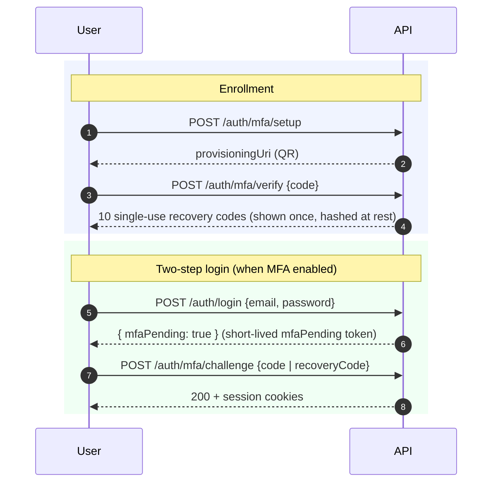
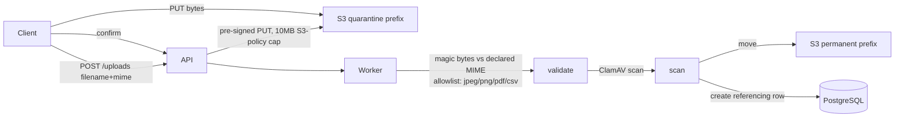

# Security & Compliance Specification — v1.0

**Product:** Multi-Tenant School Management System
**Document:** 06 — Security & Compliance
**Audience:** CISO · Security Engineers · Compliance Officers
**Authority:** Conforms to `docs/consistency-register.md` (v1.0, LOCKED) and `school-management-master-blueprint.md` (v2.0) Part IV (§18–§22), §29, §31, §32, §33, Appendix A/B. Where this document would conflict with the register, the register wins.

---

## 1. Threat Model

Likelihood/Impact are qualitative (Low/Med/High). Residual = risk after mitigation. Every mitigation has a concrete design in the blueprint (§18 requires this).

| # | Threat | Likelihood | Impact | Mitigation | Residual | Ref |
|---|---|---|---|---|---|---|
| T1 | **Cross-tenant data leak** (one school reads/writes another's rows) | Med | **High** | 3-layer defense: Prisma client extension injects/asserts `schoolId`; RLS `FORCE`d on every tenant table; merge-blocking CI isolation suite. Fail-closed on missing context. | Low | §2, §20, §21, §21.6 |
| T2 | **JWT theft / replay** | Med | High | Short-lived (15-min) access token; httpOnly/Secure/SameSite=Strict cookies (no localStorage); refresh rotation with family-reuse revocation; Redis denylist on disable/downgrade | Low | §22.1–§22.4 |
| T3 | **Credential stuffing / brute force** | High | Med | argon2id; lockout after 10 fails (15-min self-heal); HaveIBeenPwned check; per-IP + per-user rate limits; no user enumeration | Low | §22.3, §29 |
| T4 | **SQL injection** | Low | High | Prisma parameterized queries; the RLS session var is set via **parameterized** `set_config($1, …)`, never string-interpolated; `$queryRaw` requires PR justification | Low | §21.2, §34 |
| T5 | **XSS** | Med | High | React default escaping; CSP `default-src 'self'` (no inline script); sanitization of the few rich-text fields; **tokens in httpOnly cookies** so XSS cannot exfiltrate sessions | Low | §22.2, §22.7 |
| T6 | **CSRF** | Med | Med | SameSite=Strict cookies + **double-submit** `csrf` cookie / `X-CSRF-Token` header on every state-changing route (webhook exempt, HMAC instead) | Low | §22.2, §22.7 |
| T7 | **SMS PII to wrong number** (mistyped guardian phone) | Med | Med | Recipient = primary guardian only; **`phoneVerifiedAt` via OTP**; unverified numbers get only the invite OTP, never student PII (`PHONE_UNVERIFIED`) | Low | §14 |
| T8 | **Stale-cache tenant-suspension bypass** | Low | Med | Tenant cache TTL 60s **plus explicit `DEL`** on suspend/reactivate/domain-change; integration test asserts 403 on the next request | Low | §21.1 |
| T9 | **Key exposure** (encryption keys / DB creds) | Low | High | Per-tenant KMS data keys; secrets in Secrets Manager; `platform_admin` (BYPASSRLS) creds never in the API container; crypto-shred on tenant deletion | Low | §21.5, §32 |
| T10 | **Insider threat / curious DBA** | Low | High | RLS blocks app bugs + non-superuser roles; superuser restricted to **break-glass** only (audited, 4h); PII encrypted at rest; PII redacted from logs | Med* | §18, §22.9, §32 |
| T11 | **Compromised admin account** | Low | High | **MFA mandatory** for OWNER_ADMIN/ACCOUNTANT; role/password change revokes token families; sensitive actions audited (old→new) | Low | §22.5, §22.3, App-B |
| T12 | **DDoS** | Med | Med | CloudFront + WAF; Redis sliding-window rate limits; repeated tenant-level limit hits alert | Med | §3, §29 |
| T13 | **Ransomware / data loss** | Low | High | RDS PITR (5-min) + 35d; daily snapshot to a **second AWS account**; S3 versioning + CRR + MFA-delete; weekly restore-verify | Low | §33 |
| T14 | **Payment double-spend / double-post** | Med | High | `Idempotency-Key` required; serializable txn + `SELECT … FOR UPDATE`; payments immutable, reversals-only; nightly `fee-integrity-check` | Low | §12, §25.4 |
| T15 | **Malicious file upload** | Med | High | Quarantine prefix → magic-byte vs MIME allowlist (jpeg/png/pdf/csv) → **ClamAV** → move to permanent; 10MB S3-policy cap; served `Content-Disposition: attachment` from a cookieless domain | Low | §22.6 |
| T16 | **Supply-chain compromise** | Low | High | Pinned deps; TS strict; module-boundary lint; PR review checklist; `db-backup-verify` and isolation suite gate releases | Med | §34 |

\* **T10 residual is Med by design and honesty:** a Postgres superuser *can* disable RLS. The blueprint deliberately makes no "curious DBA is impossible" absolutism; it constrains superuser to the audited break-glass workflow rather than claiming the risk is zero.

---

## 2. Tenant Isolation Deep Dive

Pooled multi-tenancy (one DB, shared schema, `school_id` on every tenant row). Three independent layers — a bug in any one is caught by the others.

### 2.1 Application layer — Prisma Client Extension
Replaces the old `$use` middleware; covers **all** operations on tenant-scoped models. Fails **closed** when tenant context is missing.

```ts
// Behavior per operation (conceptual)
function tenantExtension(op, args, ctx) {
  const schoolId = cls.get('schoolId');
  if (!isUuid(schoolId)) throw new TenantViolationError('No tenant context'); // fail-closed

  switch (op) {
    case 'findMany': case 'findFirst': case 'count':
    case 'aggregate': case 'groupBy':
      args.where = { ...args.where, schoolId };            // merge filter
      return next(args);

    case 'findUnique': case 'findUniqueOrThrow':
      // unique-by-PK cannot carry an extra where → rewrite to findFirst
      return next.findFirst({ ...args, where: { ...args.where, schoolId } });

    case 'create': case 'createMany':
      injectSchoolId(args.data, schoolId);                 // inject on each element
      if (suppliedDifferentSchoolId(args.data, schoolId))
        throw new TenantViolationError('schoolId mismatch');
      return next(args);

    case 'update': case 'updateMany': case 'delete':
    case 'deleteMany': case 'upsert':
      args.where = { ...args.where, schoolId };            // merge into where
      if (op === 'upsert') injectSchoolId(args.create, schoolId); // and create arm
      return next(args);
  }
}
```
- **Workers/jobs** set CLS from the job payload's `schoolId` before touching Prisma.
- **Cross-tenant platform jobs** use a separate `platformPrisma` client on the `platform_admin` role — the request-path client can never reach another tenant.

### 2.2 Database layer — RLS
Every `school_id`-bearing table (all except `schools`) gets:

```sql
ALTER TABLE <table> ENABLE ROW LEVEL SECURITY;
ALTER TABLE <table> FORCE  ROW LEVEL SECURITY;   -- applies even to the table owner
CREATE POLICY tenant_isolation ON <table>
  FOR ALL
  USING      (school_id = current_setting('app.current_school_id', true)::uuid)
  WITH CHECK (school_id = current_setting('app.current_school_id', true)::uuid);
```

**Session variable — transaction-scoped & parameterized:**
```sql
SELECT set_config('app.current_school_id', $1, true);  -- true = transaction-local; $1 = UUID-validated CLS schoolId
```

**Wiring — the correctness pivot (`withTenant`):** `set_config(..., true)` only works if the config and the queries share one transaction on one connection.
```ts
async withTenant<T>(fn: (tx) => Promise<T>): Promise<T> {
  const schoolId = cls.get('schoolId');
  if (!isUuid(schoolId)) throw new TenantViolationError('No tenant context');
  return prisma.$transaction(async (tx) => {
    await tx.$executeRaw`SELECT set_config('app.current_school_id', ${schoolId}, true)`;
    return fn(tx);
  });
}
```
- `current_setting(..., true)` returns **NULL** when unset → predicate false → **zero rows** (fail-closed); migrations/health checks don't error.
- `schools` is **not** RLS'd (tenant resolution must read it; no child data).
- **Ops constraint:** if PgBouncer is added, it must run in **session pooling** for these connections (transaction-local settings need connection affinity).

### 2.3 Bypass-role separation
| Role | BYPASSRLS | Used by | Credential location |
|---|---|---|---|
| `app_user` | **No** | The API's request-path connection | App secret |
| `platform_admin` | **Yes** (read-mostly) | Vendor console, cross-tenant analytics jobs, tenant-export job — each connection tagged & logged | **Separate** Secrets Manager secret; **never** delivered to the API container |

### 2.4 CI layer — isolation test suite (merge-blocking)
Seeds **School A** and **School B** with full fixtures, then asserts:
1. Every list/read/write endpoint with **A's token** against **B's rows** → **403/404/empty**.
2. A raw-SQL probe inside `withTenant(A)` selecting B's rows → **0 rows** (valid now because `set_config` and query share a transaction — the prior design proved nothing).
3. `create`/`update` attempting to set **B's `schoolId`** → rejected by the **extension** AND by RLS `WITH CHECK` — both asserted independently (one variant toggles the extension off to prove RLS alone holds).
4. Any production log line tagged **`TENANT_VIOLATION`** pages on-call.

**Failing this suite blocks merge.**

---

## 3. Authentication & Authorization

### 3.1 JWT claims (authoritative shape)
```
{ sub: userId, sid: schoolId, roles: Role[], cid: campusId|null, iat, exp (15 min), kid }
```
Two signing keys active during quarterly rotation, selected by `kid`.

### 3.2 Cookie attributes
| Cookie | Attributes | Notes |
|---|---|---|
| access token | **httpOnly, Secure, SameSite=Strict** | 15-min; scoped to tenant domain |
| refresh token | httpOnly, Secure, SameSite=Strict, **path=`/api/v1/auth/refresh`** | 30-day, single-use |
| `csrf` | **non-httpOnly**, Secure, SameSite=Strict | read by JS, echoed in `X-CSRF-Token` (double-submit) |

Nothing token-shaped in localStorage → XSS cannot exfiltrate sessions.

### 3.3 Refresh rotation & family revocation
- Refresh tokens are **single-use**; each refresh issues a new token in the **same `familyId`** and revokes the used one.
- **Reuse of a revoked token → revoke the entire family** and log `REFRESH_REUSE_DETECTED` (theft signal).
- Logout revokes the presented family and clears cookies.
- Access tokens aren't denylisted (15-min blast radius accepted) **except** on account-disable and role-downgrade → userId inserted into a Redis denylist checked by the auth guard (TTL = access-token life).
- Role/password change revokes **all** refresh families immediately.

### 3.4 Login, lockout, passwords
- **argon2id** (memory 64MB, iterations 3); legacy bcrypt rehashed on first successful login.
- Min **10** chars, checked against HaveIBeenPwned k-anonymity (soft-fail if API down).
- Lockout: **10** consecutive failures → `status=LOCKED`, `lockedUntil = now()+15min`, self-heals; OWNER_ADMIN can unlock early.
- Login never distinguishes "no such user" from "wrong password".

### 3.5 MFA (TOTP, RFC 6238)
**Mandatory** for users holding OWNER_ADMIN or ACCOUNTANT; optional otherwise. Ten single-use recovery codes issued (hashed at rest).



### 3.6 Ownership guards (row-level authz — §22.8)
Run **after** RolesGuard. Each guard failure → **403** + stable error code + a structured log line (counted as a metric; a spike alerts). No AuditLog row (too noisy).

```ts
// CampusScopeGuard — CAMPUS_ADMIN (and campus-bound ACCOUNTANT)
canActivate(req) {
  const campusId = resolveResourceCampusId(req);        // from body/param/loaded row
  if (campusId !== req.user.cid) deny('CAMPUS_SCOPE');
  forceInjectListFilter(req, { campusId: req.user.cid }); // list endpoints
  return true;
}

// SectionOwnershipGuard — TEACHER writes attendance/homework
canActivate(req) {
  const { sectionId, year } = req;
  const ok = teacherAssignmentExists(req.user.staffId, year, sectionId); // homeroom(subjectId=null) OR any subject qualifies for attendance
  return ok || deny('SECTION_OWNERSHIP');
}

// SubjectOwnershipGuard — TEACHER marks entry (exact match)
canActivate(req) {
  const { sectionId, subjectId, year } = req;
  const ok = teacherAssignmentExists(req.user.staffId, year, sectionId, subjectId);
  return ok || deny('SUBJECT_OWNERSHIP');
}

// GuardianOfStudentGuard — PARENT reads (own child)
canActivate(req) {
  const ok = studentGuardianLinkExists(req.user.parentProfileId, req.targetStudentId);
  return ok || deny('GUARDIAN_SCOPE');
}

// SelfGuard — STUDENT/STAFF reads own resource
canActivate(req) {
  const ok = resourceBelongsTo(req.targetResource, req.user.studentId ?? req.user.staffId);
  return ok || deny('SELF_SCOPE');
}
```

### 3.7 Break-glass vendor access
PLATFORM_ADMIN read access to a tenant requires an explicit **support session**:
- Created with a **reason**; hard **4-hour** expiry.
- **Visible to the school's OWNER_ADMIN** in their audit view.
- Every action logged; audit `SUPPORT_SESSION_STARTED`.
- Direct production DB access follows the same break-glass ticket + logged `platform_admin` session.
- **Quarterly access reviews.**

---

## 4. Data Protection

### 4.1 Field-level encryption
| Field | Column | Algorithm | Key |
|---|---|---|---|
| Guardian CNIC | `parent_profiles.cnic_enc` | AES-256-GCM | per-tenant KMS data key |
| Staff bank account | `staff_profiles.bank_account_enc` | AES-256-GCM | per-tenant KMS data key |
| TOTP secret | `users.mfa_secret_enc` | AES-256-GCM | per-tenant KMS data key |

- Encrypt/decrypt happens in a **Prisma extension** so services see plaintext.
- **Key rotation:** annual KMS re-wrap.
- **Tenant deletion crypto-shreds** the tenant data key (renders all its ciphertext unrecoverable).

### 4.2 PII in logs (redaction)
Pino global redaction list: `password, cnic, authorization, token, phone, bankAccount`. **PII is never logged.** Structured logs carry `requestId, schoolId, userId, route, latencyMs` only.

### 4.3 Right-to-erasure — anonymization, not delete
A verified request runs an **anonymization job** (not a hard delete):
- name → `REDACTED-{shortid}`; DOB → year-only; phone/CNIC/photo → nulled; portal accounts disabled.
- **Invoices, payments, attendance, and results retain their skeleton** — legal/financial retention obligations override erasure for those records (stated in the privacy notice).
- Audit row `PII_ANONYMIZED` (metadata only) written as proof.
- **No cascade hard-delete exists in the product.**

---

## 5. File Security

### 5.1 Upload pipeline (single, for all uploads)

- 10 MB cap **enforced by the S3 policy**, not just the app.
- Anything failing magic-byte/MIME check or ClamAV never leaves quarantine.

### 5.2 Download
- Served **only** via **10-minute pre-signed GETs** issued **after an ownership check**.
- From a **cookieless domain**; `Content-Disposition: attachment` for anything non-image.

### 5.3 Web hardening (CSP & friends)
- CSP `default-src 'self'`; **no inline script**.
- HSTS, X-Content-Type-Options, Referrer-Policy, `frame-ancestors 'none'`.
- CORS: **same-origin only**; API rejects cross-origin browser requests.
- All input validated by class-validator DTOs + global whitelist ValidationPipe (`forbidNonWhitelisted: true`).

---

## 6. Compliance Matrix (retention & audit)

Retention rules (§32) mapped to the data class and enforcing mechanism.

| Data class | Tables | Retention | Immutability | Enforcing job / mechanism |
|---|---|---|---|---|
| **Attendance** | `attendance_records` | **7 years**; cold-archive after **2 years** | append/upsert with audit on change | `attendance-archive` (monthly partition move) |
| **Payments** | `fee_payments`, `payment_reversals` | **7 years minimum** | **Immutable**; corrections via reversal only | service invariant + `fee-integrity-check` (nightly) |
| **Invoices** | `fee_invoices`, `fee_invoice_items` | tied to payment retention (financial skeleton retained on erasure) | totals recomputed, never edited to WAIVED | `fee-integrity-check` |
| **SMS logs** | `sms_logs` | **90 days** | — | `sms-log-purge` (nightly) |
| **Audit logs** | `audit_logs` | **3 years** immutable, then cold | Immutable | `audit-log-rotate` (annual) |
| **Idempotency keys** | `idempotency_keys` | **48 hours** | — | `idempotency-purge` (hourly) |
| **Encrypted PII** | `cnic_enc`, `bank_account_enc`, `mfa_secret_enc` | record lifetime | crypto-shred on tenant delete | KMS key destruction |
| **Suspended tenant** | all `school_id` rows | **90-day** grace → export offered → deletion | — | vendor lifecycle + `tenant-export` |

### 6.1 Audit-action catalog (Appendix B) — what must always be audited
`FEE_WAIVED`, `FINE_WAIVED`, `PAYMENT_REVERSED`, `GRADE_CHANGED_POST_PUBLISH`, `ROLE_CHANGED`, `ATTENDANCE_EDITED_POST_WINDOW`, `DISCOUNT_APPROVED/REVOKED`, `PROMOTION_OVERRIDE`, `WITHDRAWAL_FEE_OVERRIDE`, `PII_ANONYMIZED`, `DATA_EXPORTED`, `SUPPORT_SESSION_STARTED`, `USER_DISABLED`, `MFA_RESET`.

Each writes an `AuditLog` row with `userId`, `entityType`, `entityId`, old/new values, `reason`, and `requestId`.

### 6.2 Security alerting (§31) — must page
- Any **`TENANT_VIOLATION`** log line → page (security incident; runbook §33.4, maintenance-mode flag bypasses the tenant cache).
- `fee-integrity-check` mismatch → page.
- DLQ nonzero → page.
- Repeated tenant-level rate-limit hits → alert (compromise indicator).

### 6.3 Data-export accountability
Every export (vendor full export via `tenant-export`, or school-admin self-serve CSV per report) writes a `DATA_EXPORTED` audit row **with row count**.

---

## Changelog
- **v1.0** — Initial Security & Compliance Specification. Derived from blueprint v2.0 Part IV, §32/§33, Appendix A/B and Consistency Register v1.0. Covers threat model, 3-layer tenant isolation, auth/authz with guard pseudocode + MFA flow, data protection, file security, and the retention/compliance matrix.
