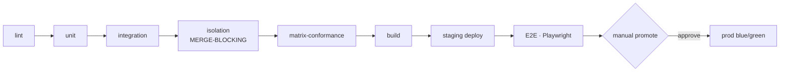

# Deployment & Infrastructure Plan — v1.0

**Product:** Multi-Tenant School Management System
**Document:** 08 — Deployment & Infrastructure
**Audience:** DevOps · SRE · Platform Engineers
**Authority:** Conforms to `docs/consistency-register.md` (v1.0, LOCKED) and `school-management-master-blueprint.md` (v2.0) §3, §21.5, §24, §33, §34. Where this document would conflict with the register, the register wins.

---

## 1. AWS Architecture

Single-region (v1), Multi-AZ. IaC in **Terraform**. Two Fargate services (API + Worker) share one image; they differ only in entrypoint.

```mermaid
graph TB
    U([Users<br/>{slug}.platform.pk · custom domains · admin.platform.pk])
    SMS[[SMS Gateway<br/>Telenor/Jazz aggregator]]

    U -->|DNS| R53[Route 53]
    R53 --> CF[CloudFront + WAF]

    subgraph AWS["AWS Region (Multi-AZ) · Terraform"]
        CF --> ALB[Application Load Balancer<br/>blue/green]

        subgraph TG["ALB Target Groups"]
            TGW[web-tg]
            TGA[api-tg]
        end
        ALB --> TGW
        ALB --> TGA

        subgraph ECS["ECS Fargate"]
            WEB[Web service<br/>Next.js 14]
            API[API service<br/>NestJS 10 · app_user]
            WORK[Worker service<br/>BullMQ consumers]
        end
        TGW --> WEB
        TGA --> API

        subgraph DATA["Data (private subnets)"]
            RDS[(RDS PostgreSQL 16<br/>Multi-AZ · RLS)]
            REDIS[(ElastiCache Redis 7<br/>cache + BullMQ)]
        end

        subgraph FILES["Files"]
            S3[(S3 versioned)]
            CFF[CloudFront<br/>cookieless file domain]
        end

        subgraph MANAGED["Managed"]
            KMS[KMS<br/>per-tenant data keys]
            SM[Secrets Manager<br/>app_user / platform_admin secrets]
        end
    end

    API -->|withTenant tx| RDS
    API --> REDIS
    API -->|enqueue| REDIS
    WORK -->|consume| REDIS
    WORK -->|app_user / platformPrisma| RDS
    API -->|pre-signed URLs| S3
    WORK --> S3
    S3 --> CFF
    API --> KMS
    API --> SM
    WORK --> SMS
    SMS -.->|delivery webhook HMAC| ALB
```

**Notes for SRE**
- **Web** and **API** are separate ALB target groups; the web app calls `/api/v1` same-origin. The SMS webhook (`POST /webhooks/sms/:provider`) enters via the ALB and is HMAC-authenticated (no JWT, host-exempt).
- **RDS is private** (no public endpoint); reached only from the ECS security group. Multi-AZ for failover.
- **Redis is ephemeral** by design — nothing recovery-critical lives only there.
- Files are served from a **cookieless CloudFront domain** via 10-minute pre-signed GETs (`Content-Disposition: attachment` for non-images).
- **Two DB roles:** the API/Worker connect as `app_user` (no `BYPASSRLS`). The `platform_admin` (BYPASSRLS) secret is a **separate** Secrets Manager entry used only by the vendor console / cross-tenant jobs / tenant-export — **never delivered to the API container**.

---

## 2. Environment Strategy

| Environment | Composition | Purpose | Promotion gate to next |
|---|---|---|---|
| **Local** | `docker-compose`: Postgres + Redis + **LocalStack** (S3/KMS/etc.) | Developer inner loop | Push a branch → CI runs |
| **CI-ephemeral** | Spun-up Postgres/Redis containers per PR | Run the full test pyramid per PR | All CI stages green (lint → unit → integration → isolation → matrix-conformance) |
| **Staging** | **Prod-shaped**, seeded **demo tenants** | Integration + E2E + load validation | E2E (Playwright) journeys green + **manual promote** |
| **Production** | Full AWS stack (this doc) | Live tenants | — (blue/green deploy with rollback section per PR) |

**Feature flags (per-tenant)** gate new modules: **pilot school → 10% → all**, with a **kill-switch per flag**. Every deploy PR contains a **rollback section**.

---

## 3. IaC & Provisioning

### 3.1 Terraform layout (suggested)
```
infra/
  modules/
    network/        # VPC, subnets (public/private), NAT, SGs
    ecs/            # cluster, api-service, worker-service, task defs, autoscaling
    rds/            # PostgreSQL 16 Multi-AZ, param group (RLS-friendly), PITR
    redis/          # ElastiCache Redis 7
    s3-cloudfront/  # versioned buckets, CRR, MFA-delete, cookieless file domain
    edge/           # Route 53, CloudFront, WAF, ACM certs
    security/       # KMS keys, Secrets Manager, IAM roles
  envs/
    staging/        # composes modules with staging vars
    production/     # composes modules with prod vars
```

### 3.2 ECS service definitions
| Service | Task | Scaling signal | Notes |
|---|---|---|---|
| **api** | 1 container (NestJS), `app_user` DB secret | Target-tracking on **CPU 60%** and **ALB request count/target** | Behind `api-tg`; connection pool `(2 × vCPU) + spare` per task |
| **worker** | 1 container (same image, worker entrypoint) | Target-tracking on **queue depth** (custom CloudWatch metric from BullMQ) + CPU | No ALB target; consumes Redis queues |
| **web** | Next.js container | CPU / request count | Behind `web-tg` |

### 3.3 Autoscaling policy targets
- **API:** scale out at CPU > 60% or when ALB `RequestCountPerTarget` exceeds the tuned threshold; min 2 tasks (HA), scale to fee-season peak.
- **Worker:** scale out on **queue depth** (aligns with the 10k-SMS-in-30-min NFR) and CPU; DLQ nonzero pages (does not auto-scale).
- **Pool-exhaustion alerting** at 90% (matches NFR §5); autoscale before saturation.

---

## 4. Database Operations

### 4.1 Migration strategy
- **Backward-compatible with N−1** (expand/contract): DB migrations **run first**, and the running (previous) app version must tolerate the new schema.
- **No column drops in the same release** — a drop ships **one release later**, after the reading code is gone.
- **Prisma migration + raw-SQL companions** ship together (§17.1): partial uniques, CHECKs, **RLS enable/policies for every `school_id` table**, `pg_trgm` + trigram index. A **CI check greps the schema and fails if any `school_id`-bearing table lacks an RLS policy.**
- PR review checklist requires: new tenant model added to the RLS migration + isolation tests; `$queryRaw` justified.

### 4.2 RDS backups & PITR
| Control | Setting |
|---|---|
| Automated backups + PITR | **35 days**, **5-min** PITR granularity (RPO ≤ 30 min) |
| Cross-account copy | **Daily snapshot copied to a second AWS account** |
| Restore target (RTO ≤ 4h) | Repoint application DB endpoint (runbook §33.4 step 6) |
| Restore verification | **Weekly** `db-backup-verify` job: restore latest snapshot to scratch + smoke test → **pages on failure** |

### 4.3 Read replicas & pooling
- **Read replicas:** not required for v1 (targets met by indexing, the stored `paid_amount`, dashboard cache, and partitioning). Add later if read pressure demands; when added, route only read-only, non-tenant-transaction traffic.
- **PgBouncer (if introduced):** must run in **session pooling** mode for tenant connections (or be bypassed) — the transaction-local `set_config('app.current_school_id', …, true)` requires connection affinity. Documented ops constraint.
- **Partitioning:** monthly on `attendance_records`, `sms_logs`, `audit_logs` from day one; archival/rotation jobs per §27.

---

## 5. CI/CD Pipeline

Order is authoritative (§34). The **isolation** and **matrix-conformance** stages are hard, merge-blocking gates.



| Stage | What runs | Gate |
|---|---|---|
| **lint** | ESLint + Prettier + **module-boundary rules** | fail = stop |
| **unit** | Jest: business rules, every state machine, fee/payroll/grading formulas (worked-example fixtures §11–§13, App-C) | fail = stop |
| **integration** | Supertest + ephemeral Postgres/Redis per PR | fail = stop |
| **isolation** | Seed School A + B; assert cross-tenant 403/404/empty & 0-rows; extension + RLS both | **merge-blocking** |
| **matrix-conformance** | Every non-`✗` §23 cell maps to a route | **merge-blocking** |
| **build** | Build image; **generate OpenAPI artifact + typed client** | fail = stop |
| **staging deploy** | Deploy to staging; DB migration runs first | fail = stop |
| **E2E** | Playwright: admit, collect fee, mark attendance, enter+publish marks, parent views report card, promotion | fail = stop |
| **prod promote** | **Manual** approval → blue/green | human gate |
| **load (pre-release)** | k6 fee-season profile (500 payment VUs + 10k SMS) | before major release |

### 5.1 Blue/green deploy & rollback
- Deploy the **green** task set behind the ALB; shift traffic after health checks pass.
- **Rollback = ALB swap back to blue** (the previous task set is kept warm during the window). Because migrations are expand/contract and N−1-compatible, blue keeps working against the new schema.
- Every deploy PR contains a **rollback section**; DB column drops are deferred one release so rollback never needs a down-migration.

---

## 6. Disaster Recovery

| Control | Cadence / setting | Runbook |
|---|---|---|
| RDS automated backups + PITR | 35 d, 5-min granularity | §33.4 full-restore |
| Cross-account snapshot | Daily copy to second AWS account | §33.4 |
| S3 durability | Versioning + **cross-region replication** + **MFA-delete** | — |
| Restore-verify | **Weekly** `db-backup-verify` → pages on failure | — |
| Restore drills | **Quarterly** | §33.4 |
| Full failover drill | **Annual** | §33.4 |
| Post-mortems | Blameless, **≤ 5 business days** | — |

### 6.1 Runbook references (§33.4 / §33.5)
- **Isolation-breach runbook:** any `TENANT_VIOLATION` log → page; maintenance-mode flag **explicitly bypasses the tenant cache** during response.
- **Full-restore runbook:** step 6 = **"Repoint application DB endpoint"** (it is a DB endpoint change, not DNS).
- **Tenant export/restore (§33.5):** `tenant-export` dumps all rows `WHERE school_id=X` across every tenant table → versioned JSONL + S3 manifest, encrypted + checksummed. This is **both** the customer-export deliverable and the **single-tenant-restore** input (restore = replay into a clean tenant id via an ops CLI). Drilled **quarterly** with a test tenant. This is the accepted mitigation for pooled tenancy's single-tenant-restore weakness.

---

## 7. Tenant Provisioning Automation

Triggered by **PLATFORM_ADMIN** via the vendor console: `POST /platform/schools` (§24). This runs as one transactional provisioning flow.

```mermaid
sequenceDiagram
    autonumber
    participant PA as PLATFORM_ADMIN (admin.platform.pk)
    participant API as Platform service (platform_admin role)
    participant DB as PostgreSQL
    participant Q as BullMQ
    PA->>API: POST /platform/schools {name, subdomain, ownerAdmin{email}, planTier}
    API->>DB: BEGIN
    API->>DB: INSERT School (subdomain unique; grNumberMode=AUTO; nextGrNumber=1; nextReceiptNo=1; settings defaults)
    API->>DB: INSERT first Campus
    API->>DB: INSERT OWNER_ADMIN User (roles=[OWNER_ADMIN], status=INVITED, no password)
    API->>DB: Seed default SmsTemplates (all trigger keys) + SchoolSettings defaults
    API->>DB: Grant initial SMS credits per plan (SmsCreditLedger: PLAN_MONTHLY) — BASIC 1k / PLUS 5k / PRO 20k
    API->>DB: COMMIT
    API->>Q: enqueue invite-sms / email (30-min set-password token to OWNER_ADMIN)
    API-->>PA: 201 (school provisioned)
```

### 7.1 What "Create School" produces
1. **`School` row** — unique `subdomain` (or a custom domain verified later), `planTier`, `grNumberMode=AUTO`, `nextGrNumber=1`, `nextReceiptNo=1`, `settings` defaults (SchoolSettings Zod schema).
2. **First `Campus`** — the school's initial campus.
3. **First `OWNER_ADMIN` `User`** — `roles=[OWNER_ADMIN]`, `status=INVITED`, no password; receives a **30-min set-password invite** (SMS/email).
4. **Seeded `SmsTemplate`s** — defaults for every trigger key (`FEE_REMINDER`, `FEE_RECEIPT`, `ABSENCE`, `RESULT_READY`, `LEAVE_STATUS`, `ACCOUNT_INVITE`, `MANUAL`), editable by OWNER_ADMIN.
5. **Seeded settings** — `SchoolSettings` defaults (attendance sessions `[MORNING]`, weekly off `[SUNDAY]`, edit window 3, proration FULL, capacity mode ADVISORY, `promotionRequiresFeeClearance=true`, `smsOverdraftSegments=100`, etc.).
6. **Initial SMS credit grant** — `SmsCreditLedger` top-up per plan tier (BASIC 1k / PLUS 5k / PRO 20k), refreshed monthly by the `sms-monthly-credit` job.

### 7.2 Lifecycle operations (also PLATFORM_ADMIN)
| Action | Endpoint | Effect |
|---|---|---|
| Suspend / reactivate | `POST /platform/schools/:id/suspend\|reactivate` | Sets `isActive`; **fires cache `DEL`** so the next request 403s `TENANT_SUSPENDED` (not after TTL) |
| Top up SMS credits | `POST /platform/schools/:id/sms-credits` | `SmsCreditLedger` PURCHASE delta |
| Export tenant | `POST /platform/schools/:id/export` | 202 → `tenant-export` job (also the single-tenant-restore input) |
| Support session | `POST /platform/support-sessions` | Break-glass: reason, 4h expiry, visible to OWNER_ADMIN, audited `SUPPORT_SESSION_STARTED` |

---

## Changelog
- **v1.0** — Initial Deployment & Infrastructure Plan. Derived from blueprint v2.0 §3, §21.5, §24, §33, §34 and Consistency Register v1.0. Covers AWS architecture, environments, IaC/ECS/autoscaling, DB ops & migrations, CI/CD with blue/green rollback, DR, and tenant provisioning automation.
