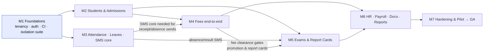
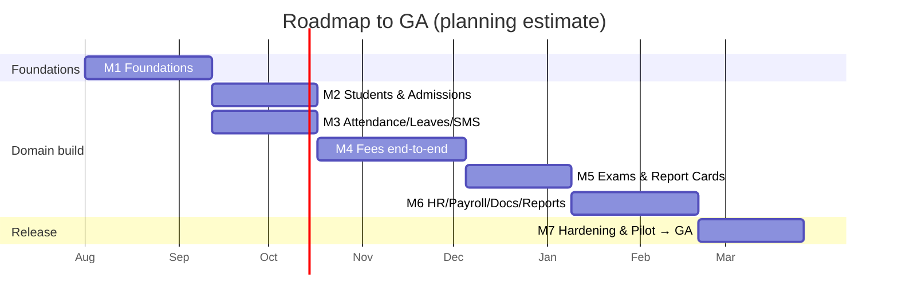

# Project Milestones / Roadmap — v1.0

**Product:** Multi-Tenant School Management System
**Document:** 10 — Project Milestones / Roadmap
**Audience:** Engineering Managers · Executives · Product Managers
**Authority:** Conforms to `docs/consistency-register.md` (v1.0, LOCKED) and `school-management-master-blueprint.md` (v2.0) §34 (delivery roadmap), §4 (scope by release), §33 (DR). Where this document would conflict with the register, the register wins.

> **Duration note:** The milestone **exit criteria and sequencing are authoritative** (from §34). **Durations are planning estimates** for a small full-stack team (≈4–6 engineers) and should be re-baselined against actual velocity — they are not fixed in the blueprint.

---

## 1. Milestone Overview

| Milestone | Est. duration | Exit criteria (gate) | Key deliverables |
|---|---|---|---|
| **M1 — Foundations** | ~6 weeks | **Tenant-isolation suite passes before any domain feature is written** | Tenancy stack (§19–§21): TenantResolutionMiddleware, `withTenant`, Prisma client extension, RLS on every `school_id` table; Auth (§22): JWT-cookie + refresh rotation, MFA, lockout; setup module; tenant provisioning; CI pipeline (lint→unit→integration→**isolation**→**matrix-conformance**→build→staging→E2E) |
| **M2 — Students & Admissions** | ~5 weeks | E2E: **admit** journey green on staging | Admissions pipeline (Inquiry state machine, entry tests); transactional admit with guardian link-or-create; student directory (trigram search); guardian linking (one primary); enrollment + transfer; students CSV import |
| **M3 — Attendance, Leaves & SMS core** | ~5 weeks | E2E: **mark attendance** green; absence SMS verified | Bulk attendance (`INSERT … ON CONFLICT`, conflict rule, edit-lock window); staff attendance; student/staff leaves (overlap rule, quotas); SMS templates + `SmsCreditLedger` + delivery webhooks + failed-messages retry |
| **M4 — Fees end-to-end** | ~7 weeks | E2E: **collect fee** green; `fee-integrity-check` clean | Fee structures/heads; idempotent invoice batches; discounts (sibling, stacking) + fines (`mark-overdue`); payments (Idempotency-Key, `FOR UPDATE`, gap-free receipts); advances/credits; reversals; waivers; defaulters; receipt SMS; reconciliation |
| **M5 — Exams & Report Cards** | ~5 weeks | E2E: **enter+publish marks** and **parent views report card** green | Grade scales; terms; exam definitions (weightage sum=100 gate); marks entry (assigned subject); publish completeness gate; term-result computation + dense rank; report-card PDF generation; result-ready SMS; post-publish correction flow |
| **M6 — HR, Payroll, Documents, Reports** | ~6 weeks | E2E: **promotion** green; all seven reports export | Staff profiles (all staff types); salary structures; payroll runs (attendance-linked deductions) + payslips; certificates (leaving/character/fee-clearance) + withdrawal workflow; audit log browser; dashboards; the seven reports; promotion workflow |
| **M7 — Hardening & Pilot** | ~5 weeks | GA readiness: load, pen test, DR drill all pass; pilot school live | k6 fee-season load (500 payment VUs + 10k SMS); penetration test; DR drill (restore + failover); pilot-school onboarding via feature flags (pilot → 10% → all); observability/alerting tuned; **GA** |

**Indicative total to GA:** ~39 weeks (~9 months) with the estimates above; parallelization across a larger team compresses M2–M6.

---

## 2. Dependency Graph & Critical Path

### 2.1 Critical-path rules (why the order is fixed)
- **M1 gates everything.** The **tenant-isolation suite passes before any domain feature is written** (§34). Isolation and matrix-conformance are merge-blocking for the whole project, not just M1.
- **M3's SMS core precedes M4's fee receipts and M5's result SMS.** Fee receipts (FEE_RECEIPT) and result-ready (RESULT_READY) sends depend on the SMS templates/credits/webhook plumbing built in M3.
- **M4 precedes M5's promotion-relevant flows.** Promotion preconditions include **fee clearance** (`promotionRequiresFeeClearance`, default true) and a **published final-term report card** — so the fee ledger (M4) and report cards (M5) must both exist before promotion (M6) can gate correctly.
- **M2 feeds M4 and M5.** Invoices attach to enrollments; exam results attach to enrollments — both need students/admissions/enrollment (M2) first.
- **Gantt view** (same dependencies, time-phased):

> M2 and M3 can run **in parallel** once M1 is green (both depend only on M1); M4 waits for both.

---

## 3. Risk Register (Top 5)

| # | Risk | Likelihood | Impact | Mitigation |
|---|---|---|---|---|
| R1 | **Tenant-isolation bug reaches production** (cross-tenant data exposure) | Low | **Critical** | 3-layer defense (Prisma extension + RLS `FORCE` + merge-blocking isolation suite); `app_user` has no BYPASSRLS; any `TENANT_VIOLATION` log **pages on-call**; isolation-breach runbook (maintenance-mode bypasses tenant cache). **SEV-1 by definition.** |
| R2 | **SMS aggregator downtime / delivery failures** | Med | High | Pluggable **adapter behind an interface** (swap providers without touching call sites); ×3 exponential-backoff retry → **failed-messages screen with one-click re-queue**; delivery webhooks reconcile status; failed-SMS >10%/30min alert. Transactional sends (ABSENCE, FEE_RECEIPT) use the overdraft buffer so credit lag doesn't block critical messages. |
| R3 | **Fee-season performance failure** (peak load) | Med | High | k6 profile (500 payment VUs + 10k SMS) runs **before each major release**; per-invoice row-lock (not global contention); stored `paid_amount`; dashboard cache; partitioned high-growth tables; autoscale API on CPU + request count, Worker on **queue depth**; pool-exhaustion alert at 90%. |
| R4 | **Data-migration / import complexity** (schools onboarding legacy data) | Med | Med | Students CSV import (v1) via the upload pipeline with **row-level error reporting**; marks CSV deferred to v1.5; expand/contract migrations (N−1 compatible, no same-release column drops); the RLS-policy CI grep prevents a new table shipping unscoped. |
| R5 | **Multi-campus edge cases** (campus-scoped authz gaps, cross-campus data bleed) | Med | High | **CampusScopeGuard** force-injects `campusId` on list endpoints and asserts on reads; **matrix-to-route conformance test** proves every scoped cell has an enforced route; composite tenant-chain FKs `(parentId, schoolId)` make cross-campus/tenant references structurally impossible at the DB. |

> **Standing rule (from Doc 09):** anything touching tenant isolation, immutable payments/reversals, or PII delivery is **SEV-1 by default** — these carry the worst blast radius and are individually alertable in production.

---

## 4. Post-GA Roadmap

Scope is fixed by §4 (Scope by Release). **No half-features ship**; v1.5/v2.0 items carry schema stubs only where noted.

### 4.1 v1.5 (post-GA increment)
| Feature | Notes |
|---|---|
| **Visual timetable** (grid editor) | v1 already ships teacher–subject **assignment** that feeds it; v1.5 adds the visual grid |
| **Homework / diary** | New module |
| **In-app + email notifications** | Complements SMS-first v1 |
| **Marks CSV import wizard** | v1 shipped the **students** CSV import; v1.5 adds **marks** |
| Optimistic concurrency (`If-Unmodified-Since`) on marks entry | Was optional in v1 |

### 4.2 v2.0
| Feature | Notes |
|---|---|
| **Library** | New module |
| **Transport** (routes, stops, transport fees) | New module |
| **Online payment gateway** (cards/wallets self-serve) | v1 records payments at counter/bank; gateway is v2 |
| **Multi-language UI (full i18n)** | Urdu SMS content supported in v1; UI English until v2 |
| **Per-school timezone** | Asia/Karachi fixed in v1 |
| Per-subject credit weighting in results | v1 uses equal subject weighting |
| Reconciliation via gateway API | v1 uses CSV import reconciliation |

### 4.3 Deferred / re-evaluate (not scheduled)
- **Hostel** — re-evaluate on demand (the `isHostelized` flag is **removed**, not stubbed).
- **Inventory** — out of scope.
- Redis eviction tuning, rate-limit threshold tuning from observed traffic, reserved-instance cost work — each has a tracker epic (§35); nothing else is deferred implicitly.

---

## 5. Governance & Milestone Exit Discipline

- **A milestone exits only with its E2E journeys green on staging** (§34).
- **Every deploy** is blue/green with a rollback section in the PR; migrations are N−1-compatible.
- **Change control:** any deviation from the blueprint requires a blueprint PR **first** (Tech Lead + PM approval); this roadmap and all `docs/` artifacts trace back to `docs/consistency-register.md` (v1.0, LOCKED).
- **Definition of Done** (per story): code + tests + OpenAPI updated + docs touched; acceptance criteria are the state machines/rules themselves.

---

## Changelog
- **v1.0** — Initial Project Milestones / Roadmap. Derived from blueprint v2.0 §34, §4, §33 and Consistency Register v1.0. Covers milestone table, dependency/critical-path graph, top-5 risk register, and the post-GA (v1.5/v2.0) roadmap. Durations are planning estimates; sequencing and exit criteria are authoritative.
